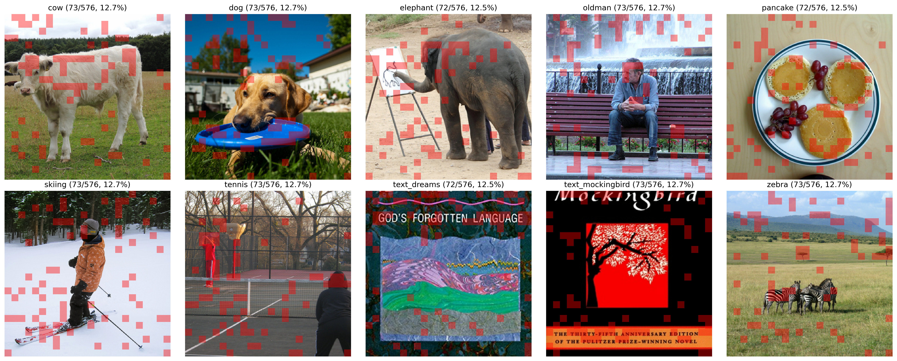
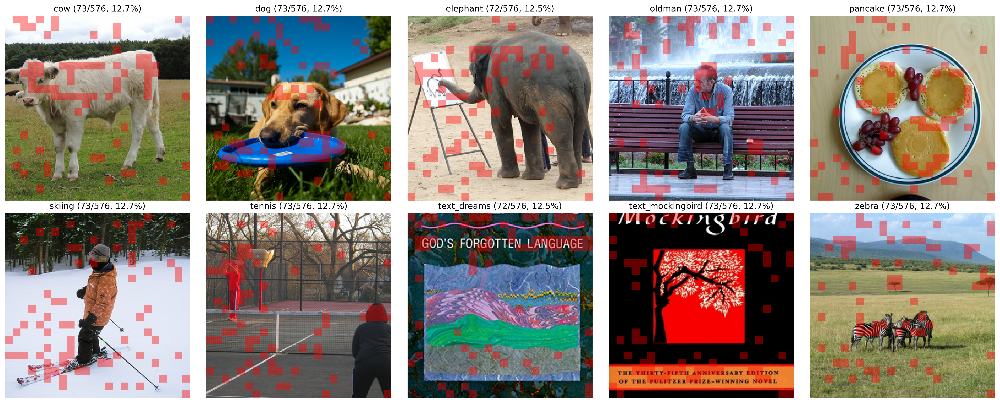
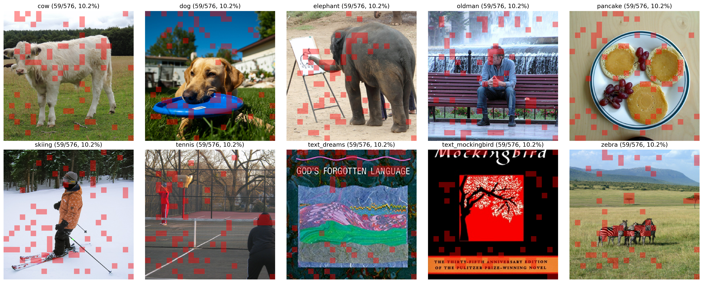

# visualization examples

## 4x compression after **llava pretraining**:

## 4x compression after **llava finetuning (lora)**:

## 8x compression after **llava pretraining**:

## 8x compression after **llava finetuning (lora)**:

## 10x compression after **llava pretraining**:

## 10 compression after **llava finetuning (lora)**:

