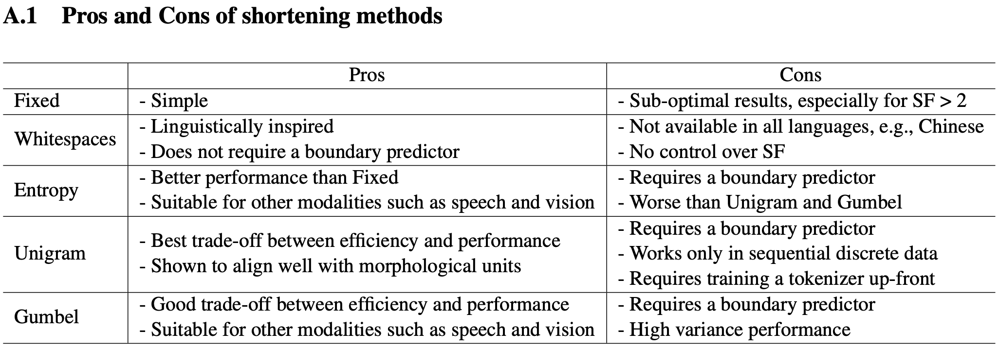
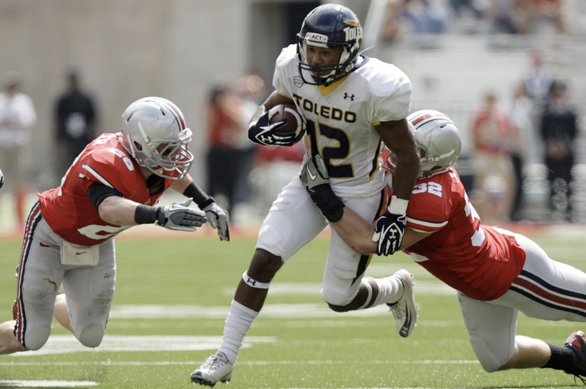

# 💧 DTP-ViT: Dynamic Token Pooling Vision Transformer

## DTP-ViT v.s. existing work

| design | approach summary |
| ------ | -------------------------- |
| **DTP-ViT** (ours!) | a single boundary predictor using **Gumbel-Sigmoid** |
| DynamicViT (2021) | a binary decision mask to **PRUNE** tokens at each transformer layer |
| TokenLearner (2021) | a spatial attention module inserted in ViT to **LEARN** tokens |  
| NativeSegViT (2025) | kmeans-like clustering to dynamically **GROUP** tokens repeatedly |

According to DTP paper, both **Gumbel-Sigmoid** and **Entropy-Spike** are very suitable to adapt to other modalities:



## DTP-ViT Architecture

```txt
input sequence
     ↓
embedding (dropout)
     ↓
pre-layers (# is a HP, 2 default)
     ↓
boundary predictor (MLP)
     ↓
downsampling 
     ↓
shortened-layers (# is a HP, 10 default)
     ↓
pooling
     ↓
dense
     ↓
embeddings ready for contrastive learning
```

## Efficiency Metrics

1. GFLOPs: a different script (adapted from **DynamicViT**), NOT during training
     1. a **pretrained** ViT-B-32 is used to compute FLOPs for ViT-B-32
     2. important Adaptations from DynamicViT:
          [FLOP measurement](https://github.com/raoyongming/DynamicViT/blob/master/calc_flops.py)
          [simulating artificial bounddaries for DynamicViT](https://github.com/raoyongming/DynamicViT/blob/master/models/dylvvit.py)

2. GPU memory and training step time are averaged for each epoch
     1. memory: torch.cuda.max_memory_allocated()
     2. training step time

## TASK 1 - ImageNet Classification

### Performance Metrics

Classification accuracy on ImageNet

### train ViTs on ImageNet-1K (1.28M images)

reference: zero-shot performance of pretrained CLIPs 

| pretrained vision encoder | corresponding dataset | zero-shot dataset | zero-shot top-1 |
| ------------------------- | --------------------- | ----------------- | --------------- |
| ViT-B-32 | laion2b_s34b_b79k | ImageNet-1K | **66.53%** |

| model | dataset pretrained on | freeze the backbone? | batch size | epoch | classification accuracy |
| ----- | --------------------- | -------------------- | ---------- | ----- | ----------------------- |
| <tr><td colspan="6" align="center"> pretrained ViT </td></tr> |
| ViT-B-32 | laion2b_s34b_b79k | **yes** | 512 | 10 | 🟢75.95% |
| ViT-B-32 | laion2b_s34b_b79k | **yes** | 512 | 30 | 🟢76.81% |
| ViT-B-32 | laion2b_s34b_b79k | finetune all | 512 | 10 | 🟠61.45%: overfitting |
| ViT-B-32 | laion2b_s34b_b79k | finetune all | 512 | 30 | 🟠60.98%: overfitting, train-acc > 96% |
| <tr><td colspan="6" align="center"> train ViT from scratch </td></tr> |
| ViT-B-32 | no initialization | **1e-4 constant scheduler** | 512 | 30 | 🔴**24.02%**: underfitting, train-acc = 24% |
| ViT-B-32 | no initialization | **6e-4 cosine scheduler with warmup** | 512 | 30 | N/A |
| <tr><td colspan="6" align="center"> train DTP-ViT from scratch </td></tr> |
| 10x compression | no initialization | **1e-4 constant scheduler** | 512 | 30 | 🔴**25.43%**: underfitting, train-acc = 24% |
| 10x compression | no initialization | **6e-4 cosine scheduler with warmup** | 512 | 30 | N/A |
| <tr><td colspan="6" align="center"> pretrained DTP-ViT </td></tr> |
| <tr><td colspan="6" align="center"> wait for a **GOOD** pretrained DTP-ViT from CLIP training! </td></tr> |


## TASK 2 - Contrastive Pretraining (CLIP)

### Performance Metrics

Top-1 Acc (%) and Top-5 Acc (%) on ImageNet **Zero-Shot**

### Efficiency Metrics

1. GFLOPs: a different script (adapted from **DynamicViT**), NOT during training
     1. a **pretrained** ViT-B-32 is used to compute FLOPs for ViT-B-32
     2. important Adaptations from DynamicViT:
          [FLOP measurement](https://github.com/raoyongming/DynamicViT/blob/master/calc_flops.py)
          [simulating artificial bounddaries for DynamicViT](https://github.com/raoyongming/DynamicViT/blob/master/models/dylvvit.py)

2. GPU memory and training step time are averaged for each epoch.
     1. memory: torch.cuda.max_memory_allocated()
     2. training step time: **already built-in** by CLIP!

### full CC12M (only 7,647,569 - 7M USABLE samples) from img2dataset [official script](https://github.com/rom1504/img2dataset/blob/main/dataset_examples/cc12m.md)

| model | GFLOPs (fvcore) | resolution | patch size | #epochs | Top-1 Acc (%) | Top-5 Acc (%) | avg GPU memory (GB) | avg training step time (s) |
| ------- | ----- | --------------- | ---------- | -------- | ---------- | ---------------- | ------------- | ---------- |
| ViT-B-32 | 2.96 | 224 | 32 | **10** | **17.14%** | 36.88% | 20.5 | 1.384 |
| 2x comp | 2.67 | 224 | 32 | **10** | **13.23%** | 30.89% | 19.6 | 1.814 |
| 4x comp | 1.82 | 224 | 32 | **10** | **13.34%** | 31.17% | 20.2 | 1.639 |
| 10x comp | 1.25 | 224 | 32 | **10** | **13.38%** | 31.19% | 20.0 | 1.343 |

### LAION-400M (only ? - ?M USABLE samples) from img2dataset [official script](https://github.com/rom1504/img2dataset/blob/main/dataset_examples/laion400m.md)

reference: zero-shot performance of pretrained CLIPs 

| pretrained vision encoder | corresponding dataset | zero-shot dataset | zero-shot top-1 |
| ------------------------- | --------------------- | ----------------- | --------------- |
| ViT-B-32 | laion400m_e31 | ImageNet-1K | **60.22%** |


## TASK 3 - Visual Instruction Tuning (LLaVA)

Visual Instruction Tuning

1. LLaVA: **pretrained** CLIP, ViT-L/14 (vision) + Vicuna (language) -> finetune end-to-end
2. dataset (LLaVA-Instruct-158K): 158K samples (58K conversations, 23K detailed description, 77K in complex reasoning)
3. 2-stages training:
     1. pretraining for feature alignment (CC-595K subset for **1 epoch**): image + question -> response; both visual encoder and LLM are frozen, only train the projection layer
     2. finetuning on (i) multimodal chatbot using LLaVA-Instruct-158K for **3 epochs** (ii) Science QA benchmark; **visual encoder is frozen**, update LLM and the projection layer 
3. Quantitative Evaluation: LLM-judge...
4. Benchmarks
     1. LLaVA-Bench (COCO): COCO-Val-2014, 30 images, 90 questions
     2. LLaVA-Bench (In-the-Wild): curate 24 images, 60 questions

running uni-test examples:



Q: What is happening in this image?

A: In the image, a football game is taking place, and a player from the team wearing the number 2 is running with the ball. He is being chased by two other players from the opposing team, who are trying to tackle him. The scene captures the intensity and excitement of the game.
