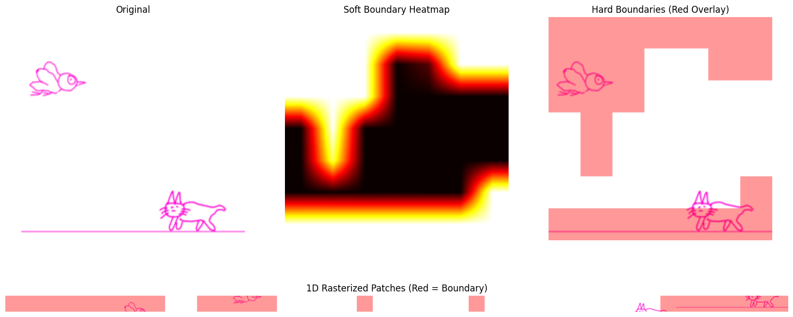
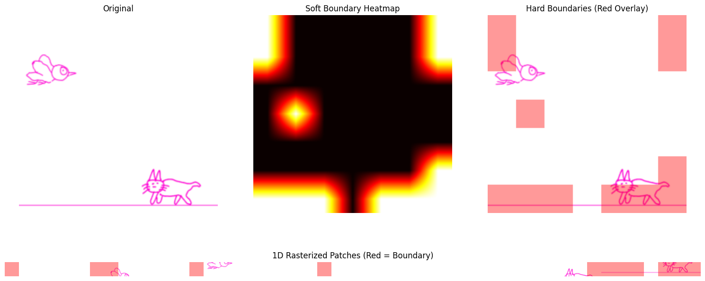
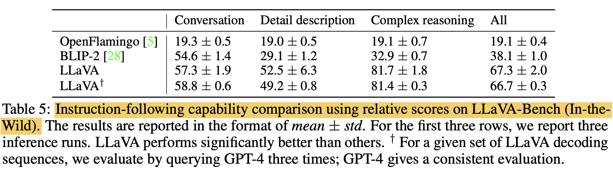
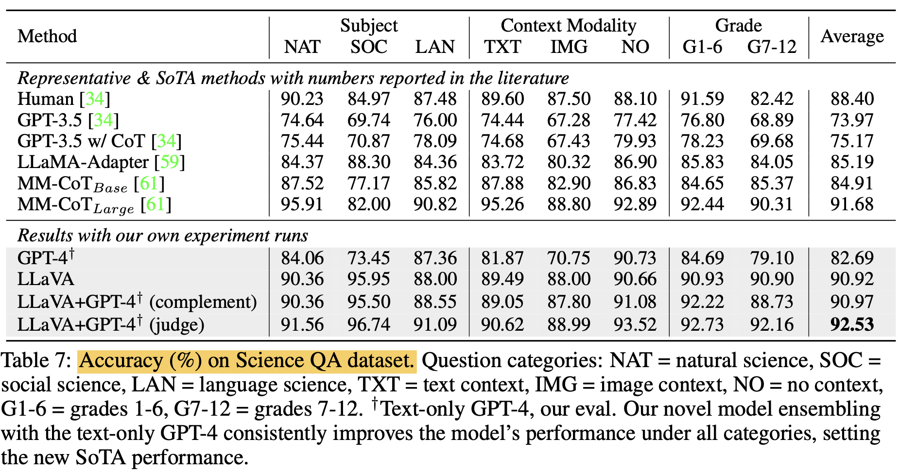

# 💧 DRIP: **D**ynamic token **R**eduction v**I**sion transformer via **P**ooling for efficient multimodal learning

## DRIP v.s. existing work

| design | approach summary |
| ------ | -------------------------- |
| **DRIP** (ours!) | a single boundary predictor using **Gumbel-Sigmoid** |
| DynamicViT (2021) | a binary decision mask to **PRUNE** tokens at each transformer layer |
| TokenLearner (2021) | a spatial attention module inserted in ViT to **LEARN** tokens |  
| NativeSegViT (2025) | kmeans-like clustering to dynamically **GROUP** tokens repeatedly |

According to DTP paper, both **Gumbel-Sigmoid** and **Entropy-Spike** are very suitable to adapt to other modalities!

## DRIP Architecture


## Efficiency Metrics

1. GFLOPs: a different script (adapted from **DynamicViT**), NOT during training
     1. a **pretrained** ViT-B-32 is used to compute FLOPs for ViT-B-32
     2. important Adaptations from DynamicViT:
          [FLOP measurement](https://github.com/raoyongming/DynamicViT/blob/master/calc_flops.py)
          [simulating artificial boundaries for DynamicViT](https://github.com/raoyongming/DynamicViT/blob/master/models/dylvvit.py)

2. GPU memory and training step time are averaged for each epoch
     1. memory: torch.cuda.max_memory_allocated()
     2. training step time

### Preliminaries: FLOP Analysis


### Preliminaries: Boundary Visualization





## TASK 1 - Contrastive Pretraining (CLIP)

### Performance Metrics

Top-1 Acc (%) and Top-5 Acc (%) on ImageNet **Zero-Shot**

### Efficiency Metrics

1. GFLOPs: a different script (adapted from **DynamicViT**), NOT during training
     1. a **pretrained** ViT-B-32 is used to compute FLOPs for ViT-B-32
     2. important Adaptations from DynamicViT:
          [FLOP measurement](https://github.com/raoyongming/DynamicViT/blob/master/calc_flops.py)
          [simulating artificial bounddaries for DynamicViT](https://github.com/raoyongming/DynamicViT/blob/master/models/dylvvit.py)

2. GPU memory and training step time are averaged for each epoch.
     1. memory: torch.cuda.max_memory_allocated()
     2. training step time: **already built-in** by CLIP!

## TASK 2 - ImageNet Classification Finetuning

### Performance Metrics

Classification accuracy on ImageNet

### train ViTs on ImageNet-1K (1.28M images)

| model | dataset pretrained on | zero-shot | freeze the backbone? | epoch | classification accuracy |
| ----- | --------------------- | -------------------- | ---------- | ----- | ----------------------- |
| <tr><td colspan="6" align="center"> pretrained ViT </td></tr> |
| ViT-B-32 | laion2b_s34b_b79k | 66.53% | yes | 30 | 🟢76.81% |
| ViT-B-32 | laion2b_s34b_b79k | 66.53% | no | 30 | 🟠60.98% |
| <tr><td colspan="6" align="center"> pretrained DRIP </td></tr> |
| DRIP-2X-16 | 280M LAION | **36.71%** | yes | 30 | **** |
| DRIP-2X-16 | 280m LAION | **36.71%** | no | 30 | **running** |

### Two errors occur IN THE MIDDLE of finetuning experiment (at epoch 38)

Error 1: unused parameters?

```python
[rank3]: RuntimeError: Expected to have finished reduction in the prior iteration before starting a new one. This error indicates that your module has parameters that were not used in producing loss. You can enable unused parameter detection by passing the keyword argument `find_unused_parameters=True` to `torch.nn.parallel.DistributedDataParallel`, and by 
[rank3]: making sure all `forward` function outputs participate in calculating loss. 
[rank3]: If you already have done the above, then the distributed data parallel module wasn't able to locate the output tensors in the return value of your module's `forward` function. Please include the loss function and the structure of the return value of `forward` of your module when reporting this issue (e.g. list, dict, iterable).
[rank3]: Parameter indices which did not receive grad for rank 3: 149 150 151 152
[rank3]:  In addition, you can set the environment variable TORCH_DISTRIBUTED_DEBUG to either INFO or DETAIL to print out information about which particular parameters did not receive gradient on this rank as part of this error
```

Error 2: NCCL timeout error?

```java
[Rank 2] Watchdog caught collective operation timeout: WorkNCCL(SeqNum=2664597, OpType=ALLREDUCE, NumelIn=8272897, NumelOut=8272897, Timeout(ms)=600000) ran for 600002 milliseconds before timing out.
```

### LAION-2B subset (26M samples) results

reference: zero-shot performance of pretrained CLIPs 

| pretrained vision encoder | corresponding dataset | zero-shot dataset | zero-shot top-1 |
| ------------------------- | --------------------- | ----------------- | --------------- |
| ViT-B-32 | laion400m_e31 | ImageNet-1K | **60.22%** |

| model | GFLOPs (fvcore) | resolution | patch size | #epochs | Top-1 Acc (%) | Top-5 Acc (%) | avg GPU memory (GB) | avg training step time (s) |
| ------- | ----- | --------------- | ---------- | -------- | ---------- | ---------------- | ------------- | ---------- |
| ViT-B-32 | 2.96 | 224 | 32 | 10 | **28.77%** | 54.34% | 20.1 | 0.429 |
| 2x comp | 2.69 | 224 | 32 | 10 | **25.72%** | 49.95% | **18.4** | **0.412** |
| 4x comp | 1.83 | 224 | 32 | 10 | **24.24%** | 47.82% | **16.3** | **0.378** |
| 10x comp | 1.26 | 224 | 32 | 10 | **21.70%** | 44.30% | **15.0** | **0.365** |
| ViT-B-16 | 11.33 | 224 | 32 | 10 | **33.88%** | 60.81% | **43.9** | **0.756** |
| 2x comp | 10.22 | 224 | 16 | 10 | **30.59%** | 57.11% | **43.0** | **0.706** |
| 4x comp | 6.62 | 224 | 16 | 10 | **28.25%** | 53.95% | **32.2** | **0.570** |
| 10x comp | 4.53 | 224 | 16 | 10 | **26.36%** | 50.79% | **26.3** | **0.515** |

## Boundary rate lower bound?


| model | expected boundary rate | lambda | actual boundary rate | zero-shot |
| ----- | ---------------------- | ------ | -------------------- | -------------------- |
| DRIP-2X-32 | 50% | 1.0 | 8/49 (**16%**) | 21.90% |


| model | expected boundary rate | lambda | actual boundary rate | zero-shot |
| ----- | ---------------------- | ------ | -------------------- | -------------------- |
| DRIP-2X-32 | 50% | 1.0 | 24/49 (**49%**) | 26.78% |

### LAION-280M (178Msamples, 178,918,585) results

| model | GFLOPs (fvcore) | resolution | patch size | #epochs | Top-1 Acc (%) | Top-5 Acc (%) | avg GPU memory (GB) | avg training step time (s) |
| ------- | ----- | --------------- | ---------- | -------- | ---------- | ---------------- | ------------- | ---------- |
| ViT-B-32 | 2.96 | 224 | 32 | 5 | **39.80%** | 68.55% | 20.1 | 0.419 |
| 2x comp | 2.69 | 224 | 32 | 5 | **35.57%** | 63.42% | **18.6** | **0.394** |
| 4x comp | 1.83 | 224 | 32 | 5 | **33.04%** | 59.58% | **16.4** | **0.368** |
| 10x comp | 1.26 | 224 | 32 | 5 | **30.91%** | 57.21% | **15.2** | **0.361** |
| ViT-B-16 | 11.33 | 224 | 32 | 3 | **39.70%** | 68.43% | 43.9 | 0.743 |
| 2x comp | 10.22 | 224 | 16 | 3 | **36.71%** | 64.98% | **43.4** | **0.703** |
| 4x comp | 6.62 | 224 | 16 | 3 | **34.14%** | 61.89% | **32.3** | **0.557** |
| 10x comp | 4.53 | 224 | 16 | 3 | **32.32%** | 59.40% | **26.2** | **0.486** |


## TASK 3 - Visual Instruction Tuning (LLaVA)

### Pretraining - Feature Alignment with **558K** samples 
     
1. image-caption data (LAION-CC-SBU with BLIP captions) -> conversation data
2. objective: image + question -> response
3. both visual encoder and LLM are frozen, only train the projectors

### Visual Instruction Tuning

dataset (LLaVA-Instruct-158K): 158K samples (58K conversations, 23K detailed description, 77K in complex reasoning)

finetuning on (i) multimodal chatbot using LLaVA-Instruct-158K for **3 epochs** (ii) Science QA benchmark; **only visual encoder is frozen**, update LLM and the projectors

### DRIP Integration debugging list

- pretraining
  - [x] precision matching: enforce float32 since it's the precision used in my DRIP checkpoint
  - [x] vision projector: ensure `embed_dim` alignment between the encoder and projector
  - [x] forward pass, but **ONLY imtermediates**: no average pooling across tokens!
- finetuning
  - [x] fixed Cuda OOM issue with finetuning
  - [x] float16 (HALF) instead of float32 (FLOAT)
  - [x] LoRA enabled
  - [ ] convert all files as .jpg in OCR-VQA [fixing]
  ```java
  [rank3]: FileNotFoundError: [Errno 2] No such file or directory: '/fs/scratch/PAS2836/yusenpeng_dataset/LLaVA_finetuning/ocr_vqa/images/689852649.jpg'
  ```

### Evaluation

benchmarks:
- [ ] LLaVA-Bench-in-the-Wild
  
  - [ ] evaluation setup
  - [ ] DRIP-2X-16 (**36.71%** zero-shot)

- [ ] ScienceQA
  
  - [ ] evaluation setup
  - [ ] DRIP-2X-16 (**36.71%** zero-shot)
