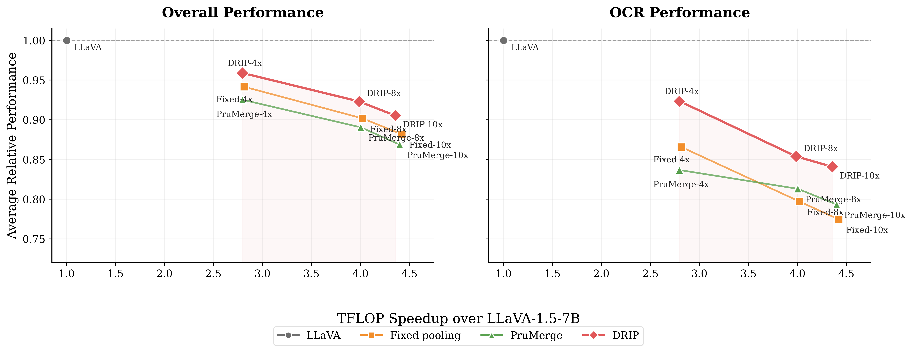
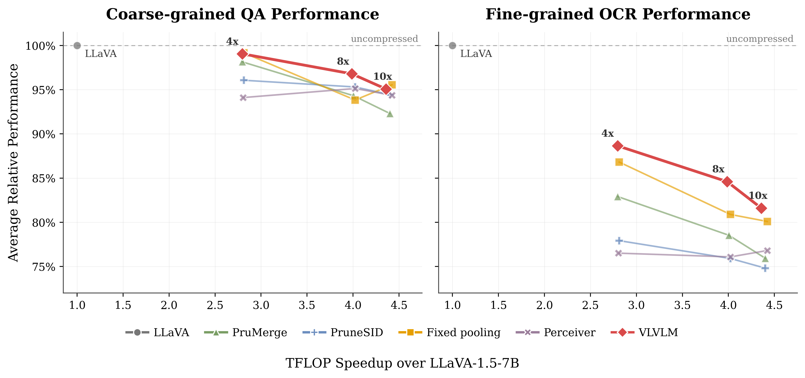
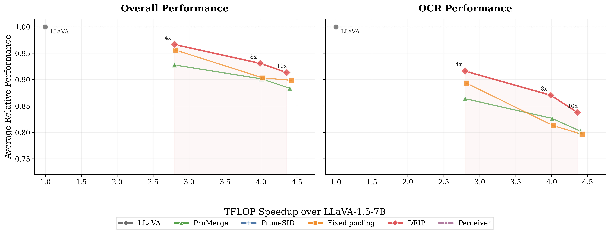
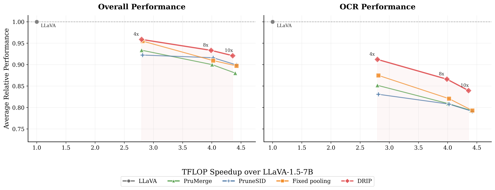
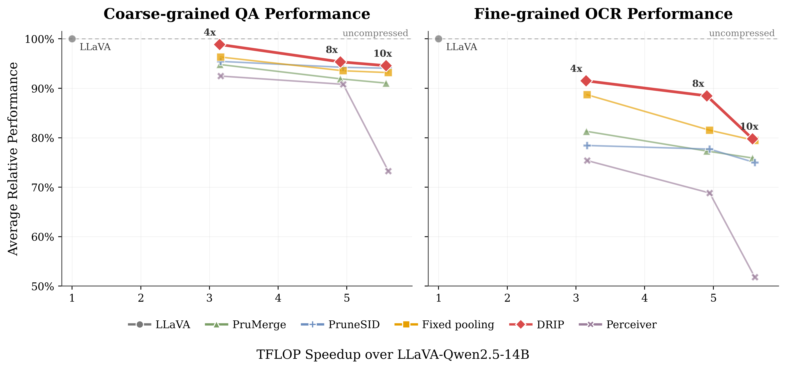
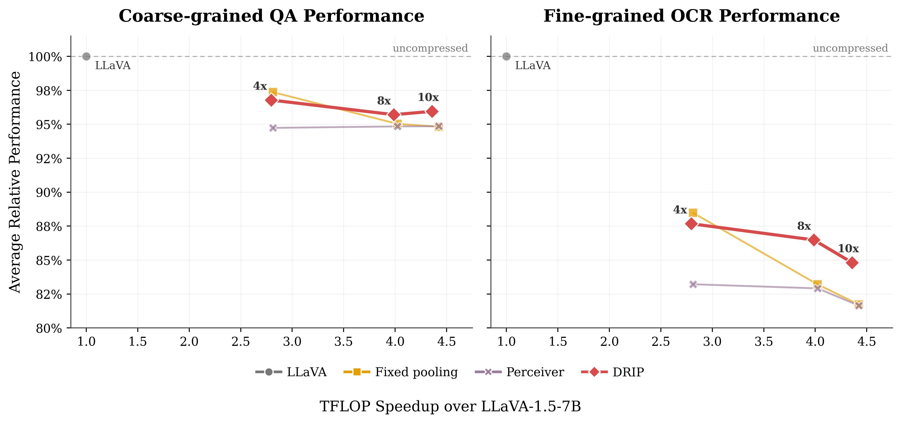
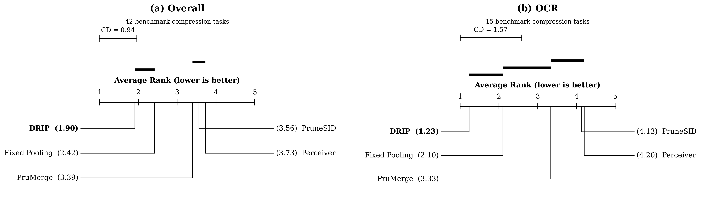

# Dynamic Image Tokenization for Efficient VLMs

## News/Updates

- [July 24, 2026] the paper draft is acccepted to [COLM 2026 Tokenization Workshop](https://www.aclweb.org/portal/content/tokenization-workshop-colm-2026)! I will be in-person presenting it in San Francisco 🌉!

## To-do list

Boundary analysis:
- [ ] a trained model called CRAFT (from CVPR 2019, https://github.com/clovaai/CRAFT-pytorch) which can detect characters/text on images. We can probably leverage this and compute the boundary overlaps, for both fixed pooling and DRIP.
- [ ] reconstructing the image in **feature-space** instead, where we can simply “upsample” (i.e., duplicate/repeat) compressed features and compute MSE with the original feature map.

Experiments: 
- [ ] Keep working on SigLIP2 experiments.
- [ ] Compression generalization evaluations.
- [ ] investigate the model’s performance in some early checkpoints (e.g., only exposed to 20%/40%/80% training data) to see how the models scale as we increase the data size.


## Environment setup

Create a new conda enviornment from scratch:

```bash
module load miniconda3/24.1.2-py310 # for OSC
module load conda # for Anvil
conda create -n DRIP python=3.11 -y
conda activate DRIP
python -m pip install -r requirements.txt
```

## LLaVA 1.5 Experiments

### Instruction

Go to file [`src/LLaVA_wrapper/llava_local/model/multimodal_encoder/builder.py`](src/LLaVA_wrapper/llava_local/model/multimodal_encoder/builder.py) to configure merging strategies and corresponding compression rate:

```python
MERGE_STRATEGY = "DRIP" # "ViT" or "DRIP" or "Fixed" or "PruMerge"
COMPRESSION_RATE = 0.25
DRIP_WEIGHT_PATH = "/path/to/LLaVA_7B_DRIP_4x_pretrain/drip.bin"
```

Additional note: the ViT backbone from LLaVA checkpoint is `openai/clip-vit-large-patch14-336`.

Then we are good to move onto benchmark experiments.

### Evaluation/Benchmarks

Do evaluation across all **14** VQA benchmarks:

```bash
bash scripts/task3/eval/EVALUATE_ALL.sh
```

## LLaVA Finetuning

Before anything, make sure flash attention is installed.

### pretraining (token alignment)

```bash
# LLaVA 1.5 with Vicuna 1.5 7B
sbatch scripts/task3/pretrain_ascend_flash.sh
# LLaVA 1.5 with Qwen 2.5 14B instruct
sbatch scripts/task3/pretrain_ascend_flash_qwen.sh
# LLaVA 1.5 with google/siglip-large-patch16-384
sbatch scripts/task3/pretrain_ascend_flash_siglip.sh
# LLaVA 1.5 with google/siglip2-large-patch16-384
sbatch scripts/task3/pretrain_ascend_flash_siglip2.sh
```

When resuming from an existing checkpoint, **make sure to update the DRIP weight path `DRIP_WEIGHT_PATH` accordingly**:

```python
DRIP_WEIGHT_PATH = "/path/to/LLaVA_7B_DRIP_4x_pretrain/drip.bin"
```

### finetuning/VQA SFT

We use ascend cluster with flash attention:

```bash
# LoRA finetuning - single GPU is fine
sbatch scripts/task3/finetune_ascend_flash.sh
# Full finetuning - must be distributed
# 2 GPUs OR 4 GPUs
sbatch scripts/task3/finetune_ascend_flash_full.sh
# Qwen 2.5 14B
sbatch scripts/task3/finetune_ascend_flash_full_qwen.sh
# SIGLIP encoder
sbatch scripts/task3/finetune_ascend_flash_full_siglip.sh
# SIGLIP v2
sbatch scripts/task3/finetune_ascend_flash_full_siglip2.sh
```

We can SSH into GPUs to check its memory usage with:

```bash
ssh <node ID> nvidia-smi
```

and process status with:

```bash
ssh <node ID> "ps -fp <job ID>"
```

When resuming from an existing checkpoint, **make sure to update the DRIP weight path `DRIP_WEIGHT_PATH`**

```python
DRIP_WEIGHT_PATH = "/path/to/LLaVA_7B_DRIP_4x_finetune_train/checkpoint-1020/drip.bin"
```

**AND the MLP projector path in the SLURM scripts**:

```bash
--pretrain_mm_mlp_adapter /path/to/LLaVA_7B_DRIP_4x_finetune_train/checkpoint-1020/mm_projector.bin \
```


## LLaVA boundary visualization

For LLaVA visualization, a GPU is definietely needed:

```bash
salloc --nodes=1 --ntasks-per-node=1 --gpus-per-node=1 -A PAS2836 --partition debug-nextgen --time 00:15:00
module load miniconda3/24.1.2-py310
conda activate DRIP_flash
python src/boundary_visual_LLaVA.py
```

You can find examples in [Boundaries.md](/Boundaries.md). You can also find interesting image feature analysis (PCA, CLS attention, cosine similarity) in [Features.md](/Features.md). Find more Benchmark example analaysis (i.e., case study) in [Examples.md](/Examples.md).


## TFLOP measurement

```bash
salloc --nodes=1 --ntasks-per-node=1 --gpus-per-node=1 -A PAS2836 --partition debug-nextgen --time 00:30:00
module load miniconda3/24.1.2-py310
conda activate DRIP_flash
# for full finetuned models
python src/GFLOP_measurement.py --model-path /path/to/LLaVA_7B_FLASH_finetune_ALL_ONCE_full
# for LoRA finetuned models
python src/GFLOP_measurement.py --model-path /path/to/LLaVA_7B_FLASH_finetune_ALL_ONCE_lora \
    --model-base lmsys/vicuna-7b-v1.5

# 🥶🥶🥶 For Qwen2.5 14B instruct, use debug-quad to avoid OOM:
salloc --nodes=1 --ntasks-per-node=1 --gpus-per-node=1 -A PAS2836 --partition debug-quad --time 00:30:00
python src/GFLOP_measurement.py --model-path /fs/scratch/PAS2836/yusenpeng_checkpoint/LLaVA_Qwen2.5-14B-Instruct_train_full --conv-mode qwen_v2
```

Important Note: for "DRIP", please go to [src/LLaVA_wrapper/llava_local/model/language_model/llava_llama.py](src/LLaVA_wrapper/llava_local/model/language_model/llava_llama.py) line #93 to temporarily toggle ``inference=False`` to ``inference=True`` to accurately evaluate the TFLOPs during prefill stage.

## Significance Test

We further apply McNemar's test statistic to assess whether the observed performance improvements are statistically significant. McNemar's test evaluates the null hypothesis that two models achieve the same performance. Specifically, let n_{01} be the number of instances answered correctly by model A but not by model B, and n_{10} be the number of instances answered correctly by model B but not by model A. The McNemar's test statistic is given by \chi^2 = \frac{\left(|n_{01}-n_{10}|-1\right)^2} {n_{01}+n_{10}}, which, under the null hypothesis that the two models have identical error rates, asymptotically follows a chi-square distribution with one degree of freedom.

## SQA

```bash
python src/mcnemar_test/SQA_test.py \
    --baseline-file /fs/scratch/PAS2836/yusenpeng_dataset/LLaVA_eval/SQA/answers/LLaVA_7B_Fixed_4x_finetune_train_full_output.jsonl \
    --method-file /fs/scratch/PAS2836/yusenpeng_dataset/LLaVA_eval/SQA/answers/LLaVA_7B_DRIP_4x_finetune_train_full_output.jsonl
```

## MME

```bash
python src/mcnemar_test/MME_test.py \
  --baseline-dir /fs/scratch/PAS2836/yusenpeng_dataset/LLaVA_eval/MME/eval_tool/answers/LLaVA_7B_Fixed_4x_finetune_train_full \
  --method-dir /fs/scratch/PAS2836/yusenpeng_dataset/LLaVA_eval/MME/eval_tool/answers/LLaVA_7B_DRIP_4x_finetune_train_full \
  --eval-type Perception
```

## MMBench

```bash
python src/mcnemar_test/MMBench_test.py \
  --annotation-file /fs/scratch/PAS2836/yusenpeng_dataset/LLaVA_eval/MMBench/mmbench_dev_20230712.tsv \
  --baseline-file /fs/scratch/PAS2836/yusenpeng_dataset/LLaVA_eval/MMBench/answers/mmbench_dev_20230712/LLaVA_7B_Fixed_4x_finetune_train_full.jsonl \
  --method-file /fs/scratch/PAS2836/yusenpeng_dataset/LLaVA_eval/MMBench/answers/mmbench_dev_20230712/LLaVA_7B_DRIP_4x_finetune_train_full.jsonl
```

## GQA

```bash
# 💚💚💚 convert files first
python src/convert_gqa_for_eval.py \
  --src /fs/scratch/PAS2836/yusenpeng_dataset/LLaVA_eval/GQA/answers/llava_gqa_testdev_balanced/LLaVA_7B_Fixed_4x_finetune_train_full.jsonl \
  --dst /fs/scratch/PAS2836/yusenpeng_dataset/LLaVA_eval/GQA/answers/llava_gqa_testdev_balanced/LLaVA_7B_Fixed_4x_finetune_train_full_predictions.json

python src/convert_gqa_for_eval.py \
  --src /fs/scratch/PAS2836/yusenpeng_dataset/LLaVA_eval/GQA/answers/llava_gqa_testdev_balanced/LLaVA_7B_DRIP_4x_finetune_train_full.jsonl \
  --dst /fs/scratch/PAS2836/yusenpeng_dataset/LLaVA_eval/GQA/answers/llava_gqa_testdev_balanced/LLaVA_7B_DRIP_4x_finetune_train_full_predictions.json

# now we can actually do the test
python src/mcnemar_test/GQA_test.py \
  --questions-file /fs/scratch/PAS2836/yusenpeng_dataset/LLaVA_eval/GQA/data/questions1/testdev_balanced_questions.json \
  --baseline-file /fs/scratch/PAS2836/yusenpeng_dataset/LLaVA_eval/GQA/answers/llava_gqa_testdev_balanced/LLaVA_7B_Fixed_4x_finetune_train_full_predictions.json \
  --method-file /fs/scratch/PAS2836/yusenpeng_dataset/LLaVA_eval/GQA/answers/llava_gqa_testdev_balanced/LLaVA_7B_DRIP_4x_finetune_train_full_predictions.json
```

## MMMU

```bash
python src/mcnemar_test/MMMU_test.py \
  --answer-path /fs/scratch/PAS2836/yusenpeng_dataset/LLaVA_eval/mmmu/answer_key/answer_dict_val.json \
  --baseline-file /fs/scratch/PAS2836/yusenpeng_dataset/LLaVA_eval/mmmu/answers/LLaVA_7B_Fixed_4x_finetune_train_full.json \
  --method-file /fs/scratch/PAS2836/yusenpeng_dataset/LLaVA_eval/mmmu/answers/LLaVA_7B_DRIP_4x_finetune_train_full.json
```

## TextVQA

```bash
python src/mcnemar_test/TextVQA_test.py \
  --annotation-file /fs/scratch/PAS2836/yusenpeng_dataset/LLaVA_eval/textVQA/TextVQA_0.5.1_val.json \
  --baseline-file /fs/scratch/PAS2836/yusenpeng_dataset/LLaVA_eval/textVQA/answers/LLaVA_7B_Fixed_4x_finetune_train_full.jsonl \
  --method-file /fs/scratch/PAS2836/yusenpeng_dataset/LLaVA_eval/textVQA/answers/LLaVA_7B_DRIP_4x_finetune_train_full.jsonl
```

## OCRBench

```bash
python src/mcnemar_test/OCRBench_test.py \
  --baseline-file /fs/scratch/PAS2836/yusenpeng_dataset/LLaVA_eval/ocrbench/results/LLaVA_7B_Fixed_4x_finetune_train_full.json \
  --method-file /fs/scratch/PAS2836/yusenpeng_dataset/LLaVA_eval/ocrbench/results/LLaVA_7B_DRIP_4x_finetune_train_full.json
```

## OCRBench v2

```bash
python src/mcnemar_test/OCRBenchv2_test.py \
  --baseline-file /fs/scratch/PAS2836/yusenpeng_dataset/LLaVA_eval/ocrbenchv2/scores/LLaVA_7B_Fixed_4x_finetune_train_full_scores.json \
  --method-file /fs/scratch/PAS2836/yusenpeng_dataset/LLaVA_eval/ocrbenchv2/scores/LLaVA_7B_DRIP_4x_finetune_train_full_scores.json
```

## DocVQA

```bash
python src/mcnemar_test/DocVQA_test.py \
  --baseline-file /fs/scratch/PAS2836/yusenpeng_dataset/LLaVA_eval/docvqa/results/LLaVA_7B_Fixed_4x_finetune_train_full_eval.json \
  --method-file /fs/scratch/PAS2836/yusenpeng_dataset/LLaVA_eval/docvqa/results/LLaVA_7B_DRIP_4x_finetune_train_full_eval.json
```


## ChartQAPro


```bash
python src/mcnemar_test/ChartQAPro_test.py \
  --gt-file /fs/scratch/PAS2836/yusenpeng_dataset/LLaVA_eval/chartvqapro/chartqapro_test_gt.json \
  --baseline-file /fs/scratch/PAS2836/yusenpeng_dataset/LLaVA_eval/chartvqapro/results/LLaVA_7B_Fixed_4x_finetune_train_full.jsonl \
  --method-file /fs/scratch/PAS2836/yusenpeng_dataset/LLaVA_eval/chartvqapro/results/LLaVA_7B_DRIP_4x_finetune_train_full.jsonl
```

## POPE

```bash
python src/mcnemar_test/POPE_test.py \
  --annotation-dir /fs/scratch/PAS2836/yusenpeng_dataset/LLaVA_eval/POPE/anno \
  --question-file /fs/scratch/PAS2836/yusenpeng_dataset/LLaVA_eval/POPE/llava_pope_test.jsonl \
  --baseline-file /fs/scratch/PAS2836/yusenpeng_dataset/LLaVA_eval/POPE/answers/LLaVA_7B_Fixed_4x_finetune_train_full.jsonl \
  --method-file /fs/scratch/PAS2836/yusenpeng_dataset/LLaVA_eval/POPE/answers/LLaVA_7B_DRIP_4x_finetune_train_full.jsonl
```


## Results

<!-- LoRA finetuning with image features from ViT's last layer:



CSV results: [results/lora_7B_last.csv](results/lora_7B_last.csv) -->

Full finetuning with image features from ViT's last layer:



raw CSV results: [results/full_7B_last.csv](results/full_7B_last.csv)

<!-- LoRA finetuning with image features from ViT's pre-final layer:



CSV results: [results/lora_7B_second_to_last.csv](results/lora_7B_second_to_last.csv) -->

Full finetuning with image features from ViT's pre-final layer:



raw CSV results: [results/full_7B_second_to_last.csv](results/full_7B_second_to_last.csv)

Full finetuning with Qwen 2.5 14B instruct model:



raw CSV results: [results/qwen14B_full_last.csv](results/qwen14B_full_last.csv)

Full finetuning with Siglip2-large image encoder:



Configuration note: 

- 4x: temperature **0.1**, **old** downsample function
- 8x and 10x: temperature **1.0**, **new** downsample function

raw CSV results: [results/SigLIP2_7B_last.csv](results/SigLIP2_7B_last.csv)


## Analysis

CD diagram for Full finetuning with image features from ViT's last layer:




## Contact

Yusen Peng (peng.1007@osu.edu)

Sachin Kumar (kumar.1145@osu.edu)