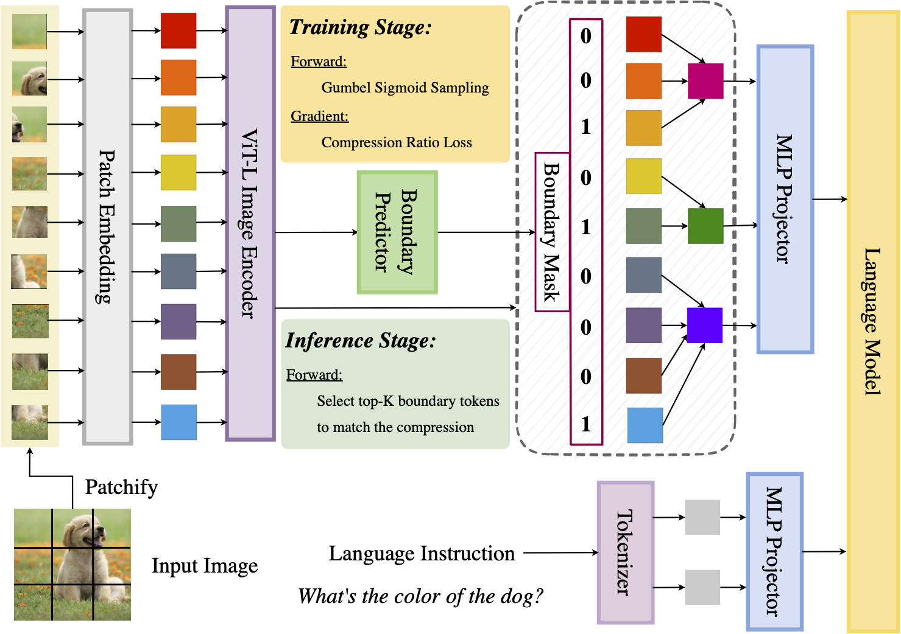
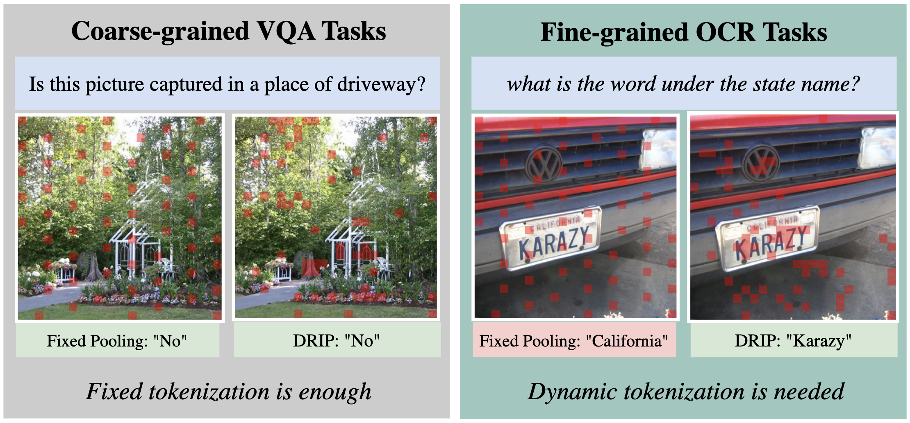
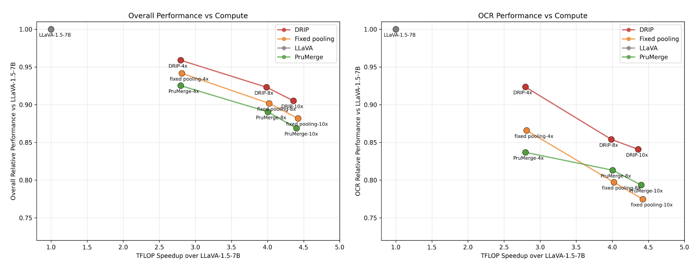
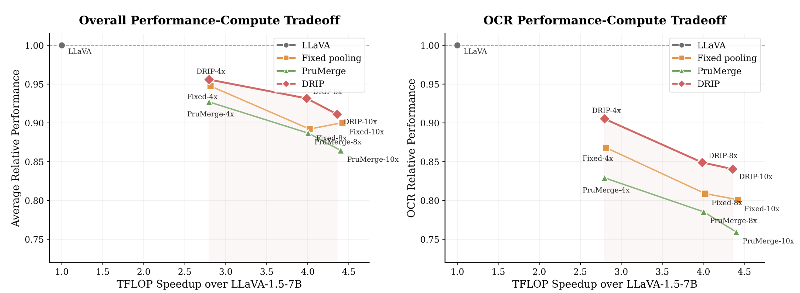
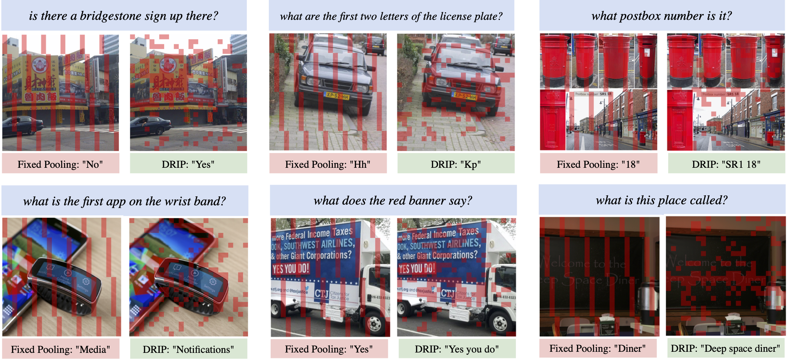
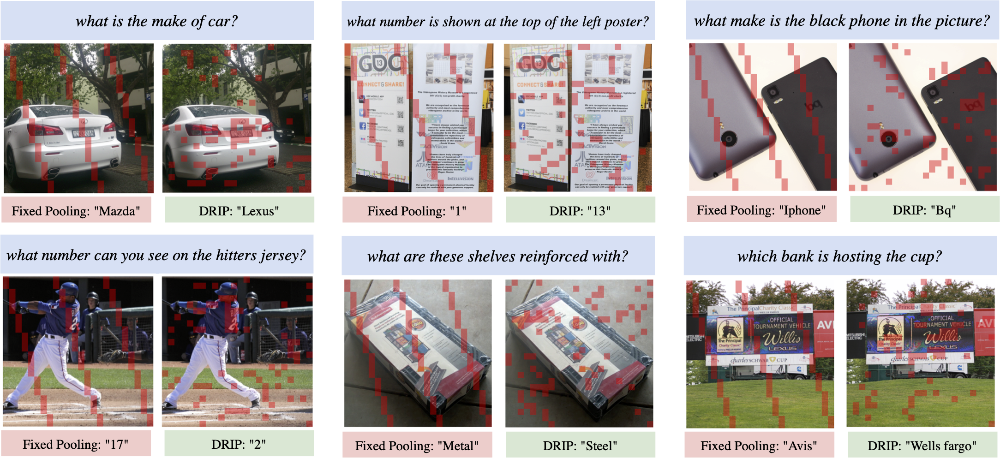
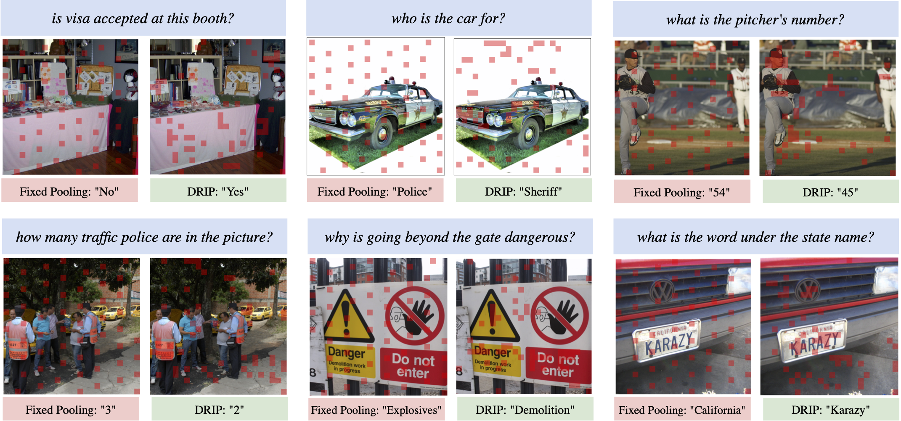

<p align="center">

</p>

<h1 align="center">DRIP</h1>
<h2 align="center">Dynamic Image Tokenization for Efficient VLMs</h2>

## TL;DR



## Environment setup

Create a new conda enviornment from scratch:

```bash
module load miniconda3/24.1.2-py310 # for OSC
module load conda # for Anvil
conda create -n DRIP python=3.11 -y
conda activate DRIP
python -m pip install -r requirements.txt
```

## LLaVA 1.5 Experiments

### Instruction

Go to file [`src/LLaVA_wrapper/llava_local/model/multimodal_encoder/builder.py`](src/LLaVA_wrapper/llava_local/model/multimodal_encoder/builder.py) to configure merging strategies and corresponding compression rate:

```python
MERGE_STRATEGY = "DRIP" # "ViT" or "DRIP" or "Fixed" or "PruMerge"
COMPRESSION_RATE = 0.25
DRIP_WEIGHT_PATH = "/path/to/LLaVA_7B_DRIP_4x_pretrain/drip.bin"
```

Additional note: the ViT backbone from LLaVA checkpoint is `openai/clip-vit-large-patch14-336`.

Then we are good to move onto benchmark experiments.

### Evaluation/Benchmarks

Do evaluation across all **14** VQA benchmarks:

```bash
bash scripts/task3/eval/EVALUATE_ALL.sh
```

## LLaVA Finetuning

Before anything, make sure flash attention is installed.

### pretraining (token alignment)

```bash
# LLaVA 1.5 with Vicuna 1.5 7B
sbatch scripts/task3/pretrain_ascend_flash.sh
# LLaVA 1.5 with Qwen 2.5 14B instruct
sbatch scripts/task3/pretrain_ascend_flash_qwen.sh
# LLaVA 1.5 with timm/vit_large_patch16_siglip_384.v2_webli
sbatch scripts/task3/pretrain_ascend_flash_siglip.sh
```

When resuming from an existing checkpoint, **make sure to update the DRIP weight path `DRIP_WEIGHT_PATH` accordingly**:

```python
DRIP_WEIGHT_PATH = "/path/to/LLaVA_7B_DRIP_4x_pretrain/drip.bin"
```

### finetuning/VQA SFT

We use ascend cluster with flash attention:

```bash
# LoRA finetuning - single GPU is fine
sbatch scripts/task3/finetune_ascend_flash.sh
# Full finetuning - must be distributed
# 2 GPUs OR 4 GPUs
sbatch scripts/task3/finetune_ascend_flash_full.sh
# Qwen 2.5 14B
sbatch scripts/task3/finetune_ascend_flash_full_qwen.sh
```

We can SSH into GPUs to check its memory usage with:

```bash
ssh <node ID> nvidia-smi
```

and process status with:

```bash
ssh <node ID> "ps -fp <job ID>"
```

When resuming from an existing checkpoint, **make sure to update the DRIP weight path `DRIP_WEIGHT_PATH`**

```python
DRIP_WEIGHT_PATH = "/path/to/LLaVA_7B_DRIP_4x_finetune_train/checkpoint-1020/drip.bin"
```

**AND the MLP projector path in the SLURM scripts**:

```bash
--pretrain_mm_mlp_adapter /path/to/LLaVA_7B_DRIP_4x_finetune_train/checkpoint-1020/mm_projector.bin \
```


## LLaVA boundary visualization

For LLaVA visualization, a GPU is definietely needed:

```bash
salloc --nodes=1 --ntasks-per-node=1 --gpus-per-node=1 -A PAS2836 --partition debug-nextgen --time 00:05:00
module load miniconda3/24.1.2-py310
conda activate DRIP_flash
python src/boundary_visual_LLaVA.py
```

You can find examples in [Boundaries.md](/Boundaries.md). You can also find interesting image feature analysis (PCA, CLS attention, cosine similarity) in [Features.md](/Features.md). Find more Benchmark example analaysis (i.e., case study) in [Examples.md](/Examples.md).


## TFLOP measurement

```bash
salloc --nodes=1 --ntasks-per-node=1 --gpus-per-node=1 -A PAS2836 --partition debug-nextgen --time 00:30:00
module load miniconda3/24.1.2-py310
conda activate DRIP_flash
# for full finetuned models
python src/GFLOP_measurement.py --model-path /path/to/LLaVA_7B_FLASH_finetune_ALL_ONCE_full
# for LoRA finetuned models
python src/GFLOP_measurement.py --model-path /path/to/LLaVA_7B_FLASH_finetune_ALL_ONCE_lora \
    --model-base lmsys/vicuna-7b-v1.5
```

Important Note: for "DRIP", please go to [src/LLaVA_wrapper/llava_local/model/language_model/llava_llama.py](src/LLaVA_wrapper/llava_local/model/language_model/llava_llama.py) line #93 to toggle ``inference=False`` to ``inference=True`` to accurately evaluate the TFLOPs during prefill stage.


## Results

LoRA finetuning with image features from ViT's last layer:



CSV results: [results/lora_7B_last.csv](results/lora_7B_last.csv)

Full finetuning with image features from ViT's last layer:



CSV results: [results/full_7B_last.csv](results/full_7B_last.csv)


## Significance Test

Please refer to [Significance.md](/Significance.md) 

## Examples from TextVQA

4x compression:



8x compression:



10 compression:



