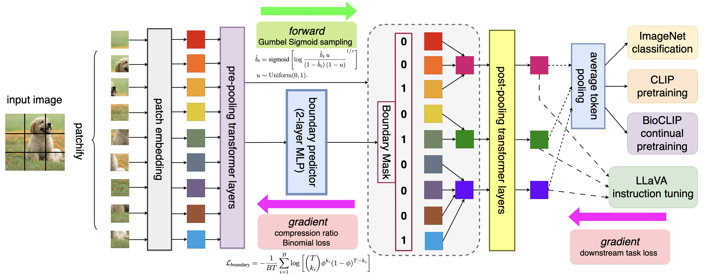

<p align="center">

</p>

<h1 align="center">DRIP</h1>
<h2 align="center">Dynamic Patch Pooling for Efficient Vision Transformers</h2>

### ☀️☀️Debugging with interactive node☀️☀️ (important)

```bash
# simple
salloc --nodes=1 --ntasks-per-node=1 --gpus-per-node=1 -A PAS2836 --time 0:15:00
# specify the CPU memory when needed
salloc --nodes=1 --ntasks-per-node=1 --gpus-per-node=1 -A PAS2836 --time 0:15:00 --mem=64G
```

## Activate Conda Env

```bash
module load miniconda3/24.1.2-py310
conda deactivate
conda activate DRIP
# a simple imagenet example (smaller batch size, single worker)
torchrun --nproc_per_node=1 src/task1_newcodebase.py --model vit_b_16 --epochs 300 --batch-size 32 --opt adamw --lr 0.0003 --wd 0.3 --lr-scheduler cosineannealinglr --lr-warmup-method linear --lr-warmup-epochs 30  --workers 1 --lr-warmup-decay 0.033 --amp --label-smoothing 0.11 --mixup-alpha 0.2 --auto-augment ra --clip-grad-norm 1 --ra-sampler --cutmix-alpha 1.0 --output-dir /fs/scratch/PAS2836/yusenpeng_checkpoint/imagenet_ViT_RP --MODE ViT-RP
# DRIP test:
torchrun --nproc_per_node=1 src/task1_newcodebase.py --model vit_b_16 --epochs 300 --batch-size 32 --opt adamw --lr 0.0003 --wd 0.3 --lr-scheduler cosineannealinglr --lr-warmup-method linear --lr-warmup-epochs 30  --workers 1 --lr-warmup-decay 0.033 --amp --label-smoothing 0.11 --mixup-alpha 0.2 --auto-augment ra --clip-grad-norm 1 --ra-sampler --cutmix-alpha 1.0 --output-dir /fs/scratch/PAS2836/yusenpeng_checkpoint/imagenet_DRIP_RP_test --MODE DRIP-RP
```


## Experiments

### ImageNet from scratch

```bash
sbatch scripts/task1/finetune_imagenet.sh
```

### CLIP pretraining from scratch

```bash
sbatch scripts/task2/multi_gpu_ascend.sh
```

### LLaVA

pretraining (low-resouce is fine):

```bash
sbatch scripts/task3/pretrain.sh
```

finetuning:

```bash
sbatch scripts/task3/finetune.sh
```


### 🔥🔥NEW🔥🔥 QwenVL series SFT

🧠🧠🧠 finetuning environment 🧠🧠🧠:

```bash
module load miniconda3/24.1.2-py310
conda create -n DRIP-VLM-FT python=3.10 -y
conda activate DRIP-VLM-FT
cd FT_QwenVL/
python -m pip install -r requirements.txt -f https://download.pytorch.org/whl/cu128
python -m pip install qwen-vl-utils
```

```bash
sbatch FT_QwenVL/scripts/finetune_lora.sh
```

or interactive mode for debugging:


```bash
salloc --nodes=1 --ntasks-per-node=1 --gpus-per-node=1 -A PAS2836 --time 0:15:00 --mem=64G
cd /users/PAS2912/yusenpeng/Fast-CLIP/FT_QwenVL/
module load miniconda3/24.1.2-py310
conda activate DRIP-VLM-FT
# 💥💥💥 absolutely needed! (otherwise, it will cause "ModuleNotFoundError: No module named 'src'") 💥💥💥
export PYTHONPATH=$PWD:$PYTHONPATH
# actual deepspeed command: set --dataloader_num_workers 0 for interactive mode!
# freeze LLM, train vision encoder (what we need the most)
deepspeed src/train/train_sft.py --use_liger_kernel True --lora_enable True --use_dora False --lora_namespan_exclude "['lm_head', 'embed_tokens']" --lora_rank 32 --lora_alpha 64 --lora_dropout 0.05 --num_lora_modules -1 --deepspeed scripts/zero3.json --model_id Qwen/Qwen3-VL-4B-Instruct --data_path /fs/scratch/PAS2836/yusenpeng_dataset/LLaVA_finetuning/cleaned.json --image_folder /fs/scratch/PAS2836/yusenpeng_dataset/LLaVA_finetuning --remove_unused_columns False --freeze_vision_tower False --freeze_llm True --freeze_merger False --bf16 True --fp16 False --disable_flash_attn2 True --output_dir /fs/scratch/PAS2836/yusenpeng_checkpoint/testing_lora --num_train_epochs 1 --per_device_train_batch_size 4 --gradient_accumulation_steps 1 --image_min_pixels $((224 * 224)) --image_max_pixels $((224 * 224)) --learning_rate 1e-4 --merger_lr 1e-5 --vision_lr 2e-6 --weight_decay 0.1 --warmup_ratio 0.03 --lr_scheduler_type "cosine" --logging_steps 1 --tf32 True --gradient_checkpointing True --report_to tensorboard --lazy_preprocess True --save_strategy "steps" --save_steps 200 --save_total_limit 10 --dataloader_num_workers 0
# skip finetuning by setting num_epochs = 0 -> in order to jump right into eval later
deepspeed src/train/train_sft.py --use_liger_kernel True --lora_enable True --use_dora False --lora_namespan_exclude "['lm_head', 'embed_tokens']" --lora_rank 32 --lora_alpha 64 --lora_dropout 0.05 --num_lora_modules -1 --deepspeed scripts/zero3.json --model_id Qwen/Qwen3-VL-4B-Instruct --data_path /fs/scratch/PAS2836/yusenpeng_dataset/LLaVA_finetuning/cleaned.json --image_folder /fs/scratch/PAS2836/yusenpeng_dataset/LLaVA_finetuning --remove_unused_columns False --freeze_vision_tower False --freeze_llm True --freeze_merger False --bf16 True --fp16 False --disable_flash_attn2 True --output_dir /fs/scratch/PAS2836/yusenpeng_checkpoint/testing_lora --num_train_epochs 0 --per_device_train_batch_size 4 --gradient_accumulation_steps 1 --image_min_pixels $((224 * 224)) --image_max_pixels $((224 * 224)) --learning_rate 1e-4 --merger_lr 1e-5 --vision_lr 2e-6 --weight_decay 0.1 --warmup_ratio 0.03 --lr_scheduler_type "cosine" --logging_steps 1 --tf32 True --gradient_checkpointing True --report_to tensorboard --lazy_preprocess True --save_strategy "steps" --save_steps 200 --save_total_limit 10 --dataloader_num_workers 0
```

## Benchmarks

[IMPORTANT] before running any benchmark, we need to merge the LoRA checkpoint:

```bash
salloc --nodes=1 --ntasks-per-node=1 --gpus-per-node=1 -A PAS2836 --time 0:15:00 --mem=64G
module load miniconda3/24.1.2-py310
conda activate DRIP-VLM
export PYTHONPATH=$PWD:$PYTHONPATH
cd /users/PAS2912/yusenpeng/Fast-CLIP/FT_QwenVL/benchmarks/mmmu
python merge_lora.py
```

### Benchmarks - MMMU

we perform inference first:

```bash
salloc --nodes=1 --ntasks-per-node=1 --gpus-per-node=1 -A PAS2836 --time 0:15:00 --mem=64G
module load miniconda3/24.1.2-py310
conda activate DRIP-VLM
export PYTHONPATH=$PWD:$PYTHONPATH
cd /users/PAS2912/yusenpeng/Fast-CLIP/FT_QwenVL/benchmarks/mmmu
python run_mmmu.py infer \
    --model-path /fs/scratch/PAS2836/yusenpeng_checkpoint/testing_lora_merged \
    --data-dir /fs/scratch/PAS2836/yusenpeng_dataset/Qwen_eval \
    --dataset MMMU_DEV_VAL \
    --output-file /fs/scratch/PAS2836/yusenpeng_dataset/Qwen_eval/mmmu_results/predictions.jsonl \
    --max-new-tokens 2048 \
    --temperature 0.7 \
    --top-p 0.8 \
    --top-k 20 \
    --repetition-penalty 1.0 \
    --presence-penalty 1.5
```

Then we can finally do evaluation (no need for GPU here):

```bash
module load miniconda3/24.1.2-py310
conda activate DRIP-VLM
export PYTHONPATH=$PWD:$PYTHONPATH
cd /users/PAS2912/yusenpeng/Fast-CLIP/FT_QwenVL/benchmarks/mmmu
export CHATGPT_DASHSCOPE_API_KEY=<api_key>
# use This API endpoint!! We are in America 🇺🇸🇺🇸
export DASHSCOPE_API_BASE="https://dashscope-us.aliyuncs.com/compatible-mode/v1/chat/completions"
python run_mmmu.py eval \
    --data-dir /fs/scratch/PAS2836/yusenpeng_dataset/Qwen_eval \
    --input-file /fs/scratch/PAS2836/yusenpeng_dataset/Qwen_eval/mmmu_results/predictions.jsonl \
    --output-file /fs/scratch/PAS2836/yusenpeng_dataset/Qwen_eval/mmmu_results/evaluation.csv \
    --dataset MMMU_DEV_VAL \
    --eval-model qwen3-max \
    --api-type dash \
    --nproc 16
```

### Benchmarks - RealWorldQA

inference:

```bash
salloc --nodes=1 --ntasks-per-node=1 --gpus-per-node=1 -A PAS2836 --time 0:15:00 --mem=64G
module load miniconda3/24.1.2-py310
conda activate DRIP-VLM
export PYTHONPATH=$PWD:$PYTHONPATH
cd /users/PAS2912/yusenpeng/Fast-CLIP/FT_QwenVL/benchmarks/RealWorldQA
python run_realworldqa.py infer \
    --model-path /fs/scratch/PAS2836/yusenpeng_checkpoint/testing_lora_merged \
    --data-dir /fs/scratch/PAS2836/yusenpeng_dataset/Qwen_eval \
    --dataset RealWorldQA \
    --output-file /fs/scratch/PAS2836/yusenpeng_dataset/Qwen_eval/realworldqa_results/predictions.jsonl \
    --max-new-tokens 2048 \
    --temperature 0.7 \
    --top-p 0.8 \
    --top-k 20 \
    --repetition-penalty 1.0 \
    --presence-penalty 1.5
```

eval:

```bash
module load miniconda3/24.1.2-py310
conda activate DRIP-VLM
export PYTHONPATH=$PWD:$PYTHONPATH
cd /users/PAS2912/yusenpeng/Fast-CLIP/FT_QwenVL/benchmarks/RealWorldQA
export CHATGPT_DASHSCOPE_API_KEY=<api_key>
# use This API endpoint!! We are in America 🇺🇸🇺🇸
export DASHSCOPE_API_BASE="https://dashscope-us.aliyuncs.com/compatible-mode/v1/chat/completions"
python run_realworldqa.py eval \
    --data-dir /fs/scratch/PAS2836/yusenpeng_dataset/Qwen_eval \
    --input-file /fs/scratch/PAS2836/yusenpeng_dataset/Qwen_eval/realworldqa_results/predictions.jsonl \
    --output-file /fs/scratch/PAS2836/yusenpeng_dataset/Qwen_eval/realworldqa_results/evaluation.csv \
    --dataset RealWorldQA \
    --eval-model qwen3-max \
    --api-type dash \
    --nproc 16
```

### Benchmarks - MathVision

infer:

```bash
# math problems are hard (therefore time-consuming)
# make sure to schedule for 6 hours on pitzer!
salloc --nodes=1 --ntasks-per-node=1 --gpus-per-node=1 -A PAS2836 --time 6:00:00 --mem=64G
module load miniconda3/24.1.2-py310
conda activate DRIP-VLM
export PYTHONPATH=$PWD:$PYTHONPATH
cd /users/PAS2912/yusenpeng/Fast-CLIP/FT_QwenVL/benchmarks/MathVision
# 8192
python run_mathv.py infer \
    --model-path /fs/scratch/PAS2836/yusenpeng_checkpoint/testing_lora_merged \
    --data-dir /fs/scratch/PAS2836/yusenpeng_dataset/Qwen_eval \
    --dataset MathVision \
    --output-file /fs/scratch/PAS2836/yusenpeng_dataset/Qwen_eval/mathvision_results/predictions.jsonl \
    --max-new-tokens 2048 \
    --temperature 0.7 \
    --top-p 0.8 \
    --top-k 20 \
    --repetition-penalty 1.0 \
    --presence-penalty 1.5 \
    --max-model-len 8192
```

eval:


```bash
module load miniconda3/24.1.2-py310
conda activate DRIP-VLM
export PYTHONPATH=$PWD:$PYTHONPATH
export CHATGPT_DASHSCOPE_API_KEY=<api_key>
# use This API endpoint!! We are in America 🇺🇸🇺🇸
export DASHSCOPE_API_BASE="https://dashscope-us.aliyuncs.com/compatible-mode/v1/chat/completions"
cd /users/PAS2912/yusenpeng/Fast-CLIP/FT_QwenVL/benchmarks/MathVision
python run_mathv.py eval \
    --data-dir /fs/scratch/PAS2836/yusenpeng_dataset/Qwen_eval \
    --input-file /fs/scratch/PAS2836/yusenpeng_dataset/Qwen_eval/mathvision_results/predictions.jsonl  \
    --output-file /fs/scratch/PAS2836/yusenpeng_dataset/Qwen_eval/mathvision_results/evaluation.csv \
    --dataset MathVision \
    --eval-model qwen3-max \
    --api-type dash \
    --nproc 16
```


## result table

| model | finetuning | configs | MMMU | RealWorldQA | MathVision |
| ----- | ---------- | ------- | ---- | ----------- | ---------- |
| ***original VLMs*** |
| Qwen3VL [paper] | - | - | 67.4% | 70.9% | 51.6% |
| Qwen3VL | no, just eval | - | 66.57% | 70.98% | 47.07% |
| Qwen3VL | 1 epoch on LLaVA | lora LLM, full FT ViT | ? | ? | ? |
| ***fixed pooling baselines*** |
| Qwen3VL-fixed-4x | no, just eval | - | ? | ? | ? |
| Qwen3VL-fixed-10x | no, just eval | - | ? | ? | ? |
| Qwen3VL-fixed-4x | 1 epoch on LLaVA | lora LLM, full FT ViT | ? | ? | ? |
| Qwen3VL-fixed-10x | 1 epoch on LLaVA | lora LLM, full FT ViT | ? | ? | ? |
| ***DRIP*** |
| Qwen3VL-DRIP-4x | 1 epoch on LLaVA | lora LLM, full FT ViT | ? | ? | ? |
| Qwen3VL-DRIP-10x | 1 epoch on LLaVA | lora LLM, full FT ViT | ? | ? | ? |


## Handy Commands

monitor all jobs:

```bash
squeue -u yusenpeng
```

check when a specific job can start running:

```bash
squeue --start -j <JOB_ID>
```

## GPU usage check

```bash
squeue -p quad -o "%.18i %.9P %.20j %.15u %.2t %.10M %.6D %R"
squeue -p nextgen -o "%.18i %.9P %.20j %.15u %.2t %.10M %.6D %R"
```


## Contacts

If you have any questions or suggestions, feel free to contact:

- Yusen Peng (peng.1007@osu.edu)
- Sachin Kumar (kumar.1145@osu.edu)

Or describe it in Issues.
