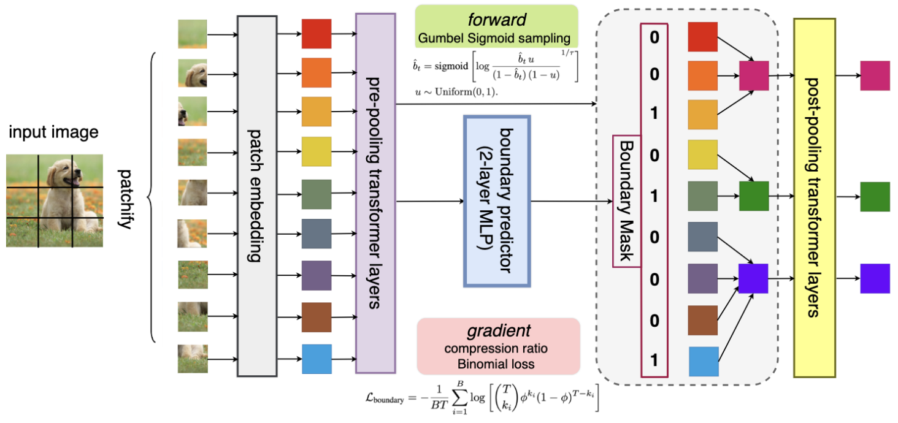
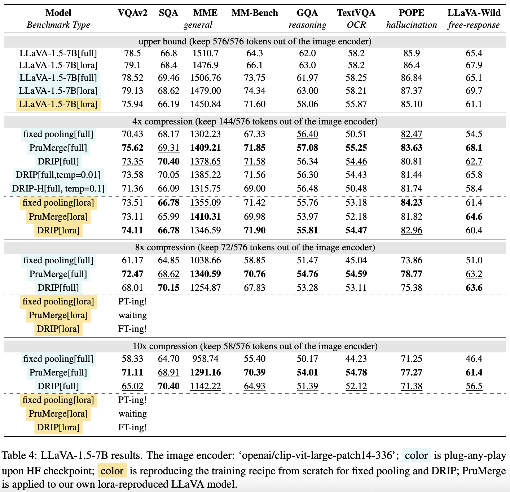

<p align="center">

</p>

<h1 align="center">DRIP</h1>
<h2 align="center">Dynamic Patch Pooling for Efficient Visual Instruction Tuning</h2>

## Environment setup

Create a new conda enviornment from scratch:

```bash
module load miniconda3/24.1.2-py310 # for OSC
module load conda # for Anvil
conda create -n DRIP python=3.11 -y
conda activate DRIP
python -m pip install -r requirements.txt
```

activate an existing one:

```bash
module load miniconda3/24.1.2-py310 # for OSC
module load conda # for Anvil
conda deactivate
conda activate DRIP
```

## ImageNet (OSC pitzer)

running training experiments:

```bash
sbatch scripts/task1/finetune_imagenet.sh
```

boundary visualization & attention map analysis:

for ImageNet

```bash
python src/boundary_visual_IN.py
```

running eval + analysis experiments:

```bash
sbatch scripts/task1/eval_imagenet.sh
```

GFLOPs measurement:

```bash
# DRIP
python src/FLOP.py --mode DRIP --compression_rate 0.25
# Fixed pooling
python src/FLOP.py --mode fixed_pooling --compression_rate 0.25
# original ViT
python src/FLOP.py --mode ViT
```

examples:

| boundaries | attention maps |
| ---------- | -------------- |
| imagenet_DRIP_4x_01_warmup2 | model_299.pth |
|  |  |
| imagenet_DRIP_4x_half_LR_no_warmup | model_299.pth |
|  |  |


## LLaVA

### Instruction

Go to file [`src/LLaVA_wrapper/llava_local/model/multimodal_encoder/builder.py`](src/LLaVA_wrapper/llava_local/model/multimodal_encoder/builder.py) to configure merging strategies(ViT/original, Fixed/fixed pooling, DRIP/dynamic tokenization) and corresponding compression rate (0.5/2x, 0.25/4x, 0.1/10x):

```python
MERGE_STRATEGY = "Fixed" # "ViT" or "DRIP" "Fixed" and more!
COMPRESSION_RATE = 0.25
```

Additional note: the ViT backbone from LLaVA checkpoint is `openai/clip-vit-large-patch14-336`.

Then we are good to move onto benchmark experiments.

### Evaluation/Benchmarks

General VQA (4):

```bash
# SQA 
sbatch scripts/task3/eval/eval_SQA.sh
# MM-Bench
sbatch scripts/task3/eval/eval_MMBench.sh
# MME
sbatch scripts/task3/eval/eval_MME.sh
# VQAv2 [🚨LONG🚨]
# need to submit the result json file to:
# https://eval.ai/web/challenges/challenge-page/830
sbatch scripts/task3/eval/eval_VQAv2.sh
```

Reasoning (1):

```bash
# GQA
sbatch scripts/task3/eval/eval_GQA.sh
```

OCR (1):

```bash
# TextVQA
sbatch scripts/task3/eval/eval_textVQA.sh
```

Hallucination (1):

```bash
# POPE
sbatch scripts/task3/eval/eval_POPE.sh
```

Free Response (1):

```bash
# LLaVA-in-the-wild
sbatch scripts/task3/eval/eval_in_the_wild.sh
```

## LLaVA Finetuning

### flash attention

Before anything, make sure flash attention is installed:

```bash
# install
sbatch flash_attn.sh
# test
sbatch test_flash_attn.sh
# what to expect: 
# torch.Size([1, 128, 8, 64]) torch.float16 cuda:0
```

### pretraining (token alignment)

```bash
# ascend with flash attention
sbatch scripts/task3/pretrain_ascend_flash.sh
# anvil
```

### finetuning/VQA SFT

```bash
# ascend with flash attention
sbatch scripts/task3/finetune_ascend_flash.sh
```


## Results




## Contacts

If you have any questions or suggestions, feel free to contact:

- Yusen Peng (peng.1007@osu.edu)
- Sachin Kumar (kumar.1145@osu.edu)

Or describe it in Issues.
