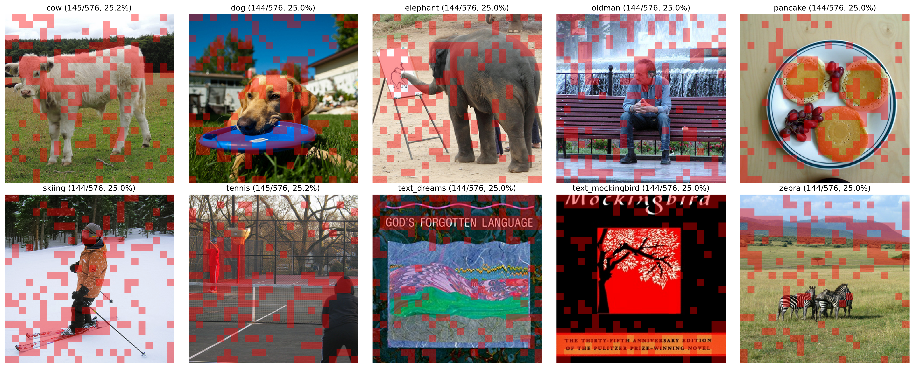
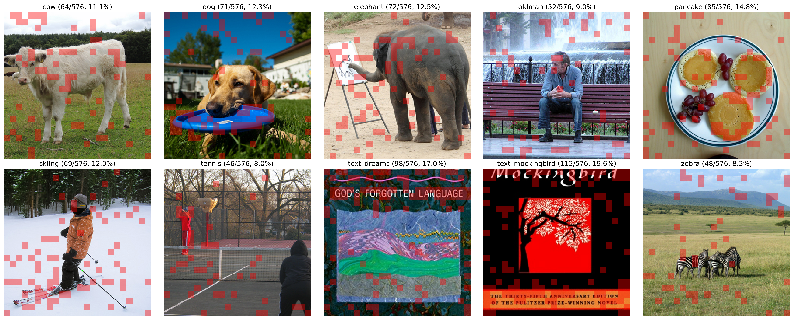
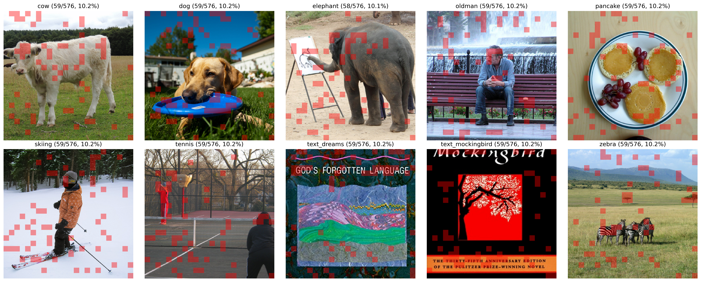
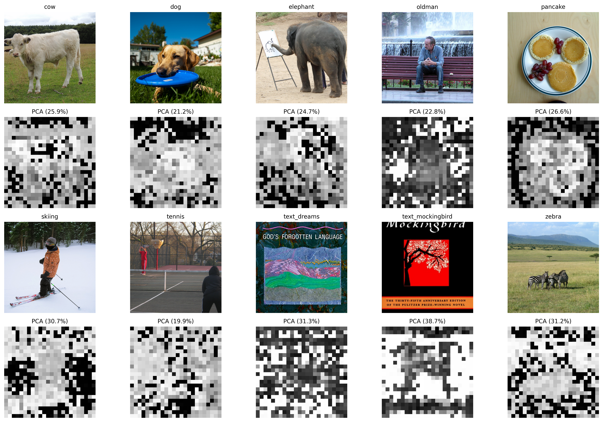
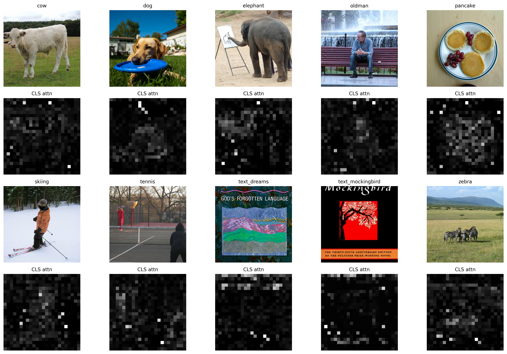
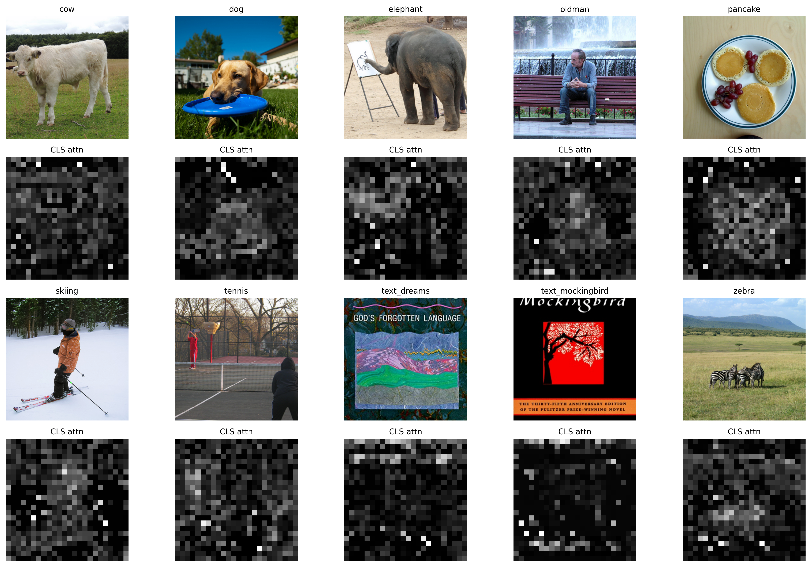
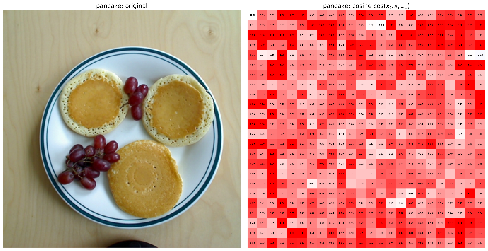

<!-- <p align="center">

</p> -->

<h1 align="center">DRIP</h1>
<h2 align="center">Dynamic Patch Pooling for Efficient Visual Instruction Tuning</h2>

## Environment setup

Create a new conda enviornment from scratch:

```bash
module load miniconda3/24.1.2-py310 # for OSC
module load conda # for Anvil
conda create -n DRIP python=3.11 -y
conda activate DRIP
python -m pip install -r requirements.txt
```

activate an existing one:

```bash
module load miniconda3/24.1.2-py310 # for OSC
module load conda # for Anvil
conda deactivate
conda activate DRIP
```

<!-- ## ImageNet (OSC pitzer)

running training experiments:

```bash
sbatch scripts/task1/finetune_imagenet.sh
```

boundary visualization & attention map analysis:

for ImageNet

```bash
python src/boundary_visual_IN.py
```

running eval + analysis experiments:

```bash
sbatch scripts/task1/eval_imagenet.sh
```

GFLOPs measurement:

```bash
# DRIP
python src/FLOP.py --mode DRIP --compression_rate 0.25
# Fixed pooling
python src/FLOP.py --mode fixed_pooling --compression_rate 0.25
# original ViT
python src/FLOP.py --mode ViT
```

examples:

| boundaries | attention maps |
| ---------- | -------------- |
| imagenet_DRIP_4x_01_warmup2 | model_299.pth |
|  |  |
<!-- | imagenet_DRIP_4x_half_LR_no_warmup | model_299.pth |
|  |  | --> -->


## LLaVA 1.5 Experiments

### Instruction

Go to file [`src/LLaVA_wrapper/llava_local/model/multimodal_encoder/builder.py`](src/LLaVA_wrapper/llava_local/model/multimodal_encoder/builder.py) to configure merging strategies and corresponding compression rate:

```python
MERGE_STRATEGY = "DRIP" # "ViT" or "DRIP" or "Fixed" or "PruMerge"
COMPRESSION_RATE = 0.25
DRIP_WEIGHT_PATH = "/fs/scratch/PAS2836/yusenpeng_checkpoint/LLaVA_7B_DRIP_4x_pretrain/drip.bin"
```

Additional note: the ViT backbone from LLaVA checkpoint is `openai/clip-vit-large-patch14-336`.

Then we are good to move onto benchmark experiments.

### Evaluation/Benchmarks

General VQA (4):

```bash
# VQAv2 [🚨LONG🚨]
# need to submit the result json file to:
# https://eval.ai/web/challenges/challenge-page/830
sbatch scripts/task3/eval/eval_VQAv2.sh
# SQA 
sbatch scripts/task3/eval/eval_SQA.sh
# MME
sbatch scripts/task3/eval/eval_MME.sh
# MM-Bench
sbatch scripts/task3/eval/eval_MMBench.sh
```

Reasoning (1):

```bash
# GQA
sbatch scripts/task3/eval/eval_GQA.sh
```

OCR (1):

```bash
# TextVQA
sbatch scripts/task3/eval/eval_textVQA.sh
```

Hallucination (1):

```bash
# POPE
sbatch scripts/task3/eval/eval_POPE.sh
```

Free Response (1):

```bash
# LLaVA-in-the-wild
sbatch scripts/task3/eval/eval_in_the_wild.sh
```

## LLaVA Finetuning

### flash attention

Before anything, make sure flash attention is installed:

```bash
# install
sbatch flash_attn.sh
# test
sbatch test_flash_attn.sh
# what to expect: 
# torch.Size([1, 128, 8, 64]) torch.float16 cuda:0
```

### pretraining (token alignment)

```bash
# ascend with flash attention
sbatch scripts/task3/pretrain_ascend_flash.sh
```

When resuming from an existing checkpoint, **make sure to update the DRIP weight path `DRIP_WEIGHT_PATH` accordingly**:

```python
DRIP_WEIGHT_PATH = "/fs/scratch/PAS2836/yusenpeng_checkpoint/LLaVA_7B_DRIP_4x_pretrain/drip.bin"
```

### finetuning/VQA SFT

```bash
# ascend with flash attention
sbatch scripts/task3/finetune_ascend_flash.sh
```

When resuming from an existing checkpoint, **make sure to update the DRIP weight path `DRIP_WEIGHT_PATH`**

```python
DRIP_WEIGHT_PATH = "/fs/scratch/PAS2836/yusenpeng_checkpoint/LLaVA_7B_DRIP_4x_finetune_train/checkpoint-1020/drip.bin"
```

**AND the MLP projector path in the SLURM scripts**:

```bash
--pretrain_mm_mlp_adapter /fs/scratch/PAS2836/yusenpeng_checkpoint/LLaVA_7B_DRIP_4x_finetune_train/checkpoint-1020/mm_projector.bin \
```


## LLaVA boundary visualization

For LLaVA visualization, a GPU is definietely needed:

```bash
salloc --nodes=1 --ntasks-per-node=1 --gpus-per-node=1 -A PAS2836 --partition debug-nextgen --time 00:05:00
module load miniconda3/24.1.2-py310
conda activate DRIP_flash
python src/boundary_visual_LLaVA.py
```

### visualization examples

4x compression after **llava pretraining**:



4x compression after **llava finetuning (lora)**:



10x compression after **llava pretraining**:




## LLaVA image feature analysis

We conduct multiple analyses on image features: (1) PCA; (2) CLS attention; (3) token cosine dissimilarity.

### PCA and CLS attention

```bash
salloc --nodes=1 --ntasks-per-node=1 --gpus-per-node=1 -A PAS2836 --partition debug-nextgen --time 00:15:00
module load miniconda3/24.1.2-py310
conda activate DRIP_flash
python src/feature_visual_LLaVA.py
```

PCA upon 24th-layer features:



CLS attention (head-mean) upon 24th-layer features:



CLS attention (head-max) upon 24th-layer features:




### token cosine similarity

```bash
salloc --nodes=1 --ntasks-per-node=1 --gpus-per-node=1 -A PAS2836 --partition debug-nextgen --time 00:15:00
module load miniconda3/24.1.2-py310
conda activate DRIP_flash
python src/cossim_visual_LLaVA.py
```

example:




## Benchmark Results

LLaVA 7B:


LLaVA 13B:

coming soon!