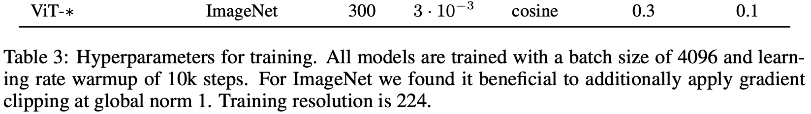

# 💧 DTP-ViT: Dynamic Token Pooling Vision Transformer

## DTP-ViT v.s. existing work

| design | approach summary |
| ------ | -------------------------- |
| **DTP-ViT** (ours!) | a single boundary predictor using **Gumbel-Sigmoid** |
| DynamicViT (2021) | a binary decision mask to **PRUNE** tokens at each transformer layer |
| TokenLearner (2021) | a spatial attention module inserted in ViT to **LEARN** tokens |  
| NativeSegViT (2025) | kmeans-like clustering to dynamically **GROUP** tokens repeatedly |

According to DTP paper, both **Gumbel-Sigmoid** and **Entropy-Spike** are very suitable to adapt to other modalities:


## DTP-ViT Architecture

```txt
input sequence
     ↓
embedding (dropout)
     ↓
pre-layers (# is a HP, 2 default)
     ↓
boundary predictor (MLP)
     ↓
downsampling 
     ↓
shortened-layers (# is a HP, 10 default)
     ↓
pooling
     ↓
dense
     ↓
embeddings ready for contrastive learning
```

## Efficiency Metrics

1. GFLOPs: a different script (adapted from **DynamicViT**), NOT during training
     1. a **pretrained** ViT-B-32 is used to compute FLOPs for ViT-B-32
     2. important Adaptations from DynamicViT:
          [FLOP measurement](https://github.com/raoyongming/DynamicViT/blob/master/calc_flops.py)
          [simulating artificial boundaries for DynamicViT](https://github.com/raoyongming/DynamicViT/blob/master/models/dylvvit.py)

2. GPU memory and training step time are averaged for each epoch
     1. memory: torch.cuda.max_memory_allocated()
     2. training step time

## TASK 1 - ImageNet Classification

### Performance Metrics

Classification accuracy on ImageNet

### train ViTs on ImageNet-1K (1.28M images)

reference: zero-shot performance of pretrained CLIPs 

| pretrained vision encoder | corresponding dataset | zero-shot dataset | zero-shot top-1 |
| ------------------------- | --------------------- | ----------------- | --------------- |
| ViT-B-32 | laion2b_s34b_b79k | ImageNet-1K | **66.53%** |

From ViT ("AN IMAGE IS WORTH 16X16 WORDS") paper (it mainly focuses on **PRE-training**):

*"Table 3 summarizes our training setups for our different models. We found strong **regularization** to be key when training models from **scratch** on ImageNet.*



Seems like people struggle with training ViT from scratch too:


some variants of ViT (ViT-SAM and T2T-ViT) claims otherwise...


Potential improvement? (more epochs, smaller patch size, data augmentation, label smoothing, gradient clipping)

| model | dataset pretrained on | freeze the backbone? | batch size | epoch | classification accuracy |
| ----- | --------------------- | -------------------- | ---------- | ----- | ----------------------- |
| <tr><td colspan="6" align="center"> pretrained ViT </td></tr> |
| ViT-B-32 | laion2b_s34b_b79k | **yes** | 512 | 10 | 🟢75.95% |
| ViT-B-32 | laion2b_s34b_b79k | **yes** | 512 | 30 | 🟢76.81% |
| ViT-B-32 | laion2b_s34b_b79k | finetune all | 512 | 10 | 🟠61.45%: overfitting |
| ViT-B-32 | laion2b_s34b_b79k | finetune all | 512 | 30 | 🟠60.98%: overfitting, train-acc > 96% |
| <tr><td colspan="6" align="center"> train ViT from scratch </td></tr> |
| ViT-B-32 | no initialization | **1e-4 constant scheduler** | 512 | 30 | 🔴**24.02%**: underfitting, train-acc = 24% |
| ViT-B-32 | no initialization | **6e-4 cosine scheduler with warmup** | 512 | 30 | 🔴**35.92%** |
| <tr><td colspan="6" align="center"> train DTP-ViT from scratch </td></tr> |
| 10x compression | no initialization | **1e-4 constant scheduler** | 512 | 30 | 🔴**25.43%**: underfitting, train-acc = 24% |
| 10x compression | no initialization | **6e-4 cosine scheduler with warmup** | 512 | 30 | 🔴**24.95%**: underfitting, train-acc = 24% |
| <tr><td colspan="6" align="center"> pretrained DTP-ViT </td></tr> |
| <tr><td colspan="6" align="center"> wait for a **GOOD** pretrained DTP-ViT from CLIP training! </td></tr> |


## TASK 2 - Contrastive Pretraining (CLIP)

### Performance Metrics

Top-1 Acc (%) and Top-5 Acc (%) on ImageNet **Zero-Shot**

### Efficiency Metrics

1. GFLOPs: a different script (adapted from **DynamicViT**), NOT during training
     1. a **pretrained** ViT-B-32 is used to compute FLOPs for ViT-B-32
     2. important Adaptations from DynamicViT:
          [FLOP measurement](https://github.com/raoyongming/DynamicViT/blob/master/calc_flops.py)
          [simulating artificial bounddaries for DynamicViT](https://github.com/raoyongming/DynamicViT/blob/master/models/dylvvit.py)

2. GPU memory and training step time are averaged for each epoch.
     1. memory: torch.cuda.max_memory_allocated()
     2. training step time: **already built-in** by CLIP!

### FLOP analysis w.r.t Patch Size and Compression Rate


### CC12M results

| model | GFLOPs (fvcore) | resolution | patch size | #epochs | Top-1 Acc (%) | Top-5 Acc (%) | avg GPU memory (GB) | avg training step time (s) |
| ------- | ----- | --------------- | ---------- | -------- | ---------- | ---------------- | ------------- | ---------- |
| ViT-B-32 | **2.96** | 224 | 32 | 10 | **17.14%** | 36.88% | 20.5 | 1.384 |
| 2x comp | **2.69** | 224 | 32 | 10 | **13.23%** | 30.89% | 19.6 | 1.814 |
| 4x comp | **1.83** | 224 | 32 | 10 | **13.34%** | 31.17% | 20.2 | 1.639 |
| 10x comp | **1.26** | 224 | 32 | 10 | **13.38%** | 31.19% | 20.0 | 1.343 |

### LAION-400M results

Examples of failure:

```JSON
{
    "count": 10000,
    "successes": 6594,
    "failed_to_download": 3126,
    "failed_to_resize": 280,
    "status_dict": {
        "HTTP Error 404: Not Found": 1267,
        "HTTP Error 403: Forbidden": 573,
        "<urlopen error [Errno -2] Name or service not known>": 433
    }
}
```

reference: zero-shot performance of pretrained CLIPs 

| pretrained vision encoder | corresponding dataset | zero-shot dataset | zero-shot top-1 |
| ------------------------- | --------------------- | ----------------- | --------------- |
| ViT-B-32 | laion400m_e31 | ImageNet-1K | **60.22%** |

running!

## TASK 3 - Visual Instruction Tuning (LLaVA)

Benchmarks

1. LLaVA-Bench (COCO): COCO-Val-2014, 30 images, 90 questions
2. LLaVA-Bench (In-the-Wild): curate 24 images, 60 questions

### Pretraining - Feature Alignment

dataset (already prepared🔥): **558K** samples 
     
1. image-caption data (LAION-CC-SBU with BLIP captions) -> conversation data
2. objective: image + question -> response
3. both visual encoder and LLM are frozen, only train the projection layer

Pretraining experiment (taking ~30 hours with ViT-L-14, vicuna-7B, **1 epoch**):

```T
{'loss': 3.079, 'grad_norm': 2.3081312761181407, 'learning_rate': 0.00016603053435114505, 'epoch': 0.0}

  0%|          | 87/17442 [09:53<32:10:50,  6.68s/it]
  1%|          | 88/17442 [10:00<32:06:43,  6.66s/it]
                                                     
{'loss': 3.1545, 'grad_norm': 2.3411817490443343, 'learning_rate': 0.00016793893129770992, 'epoch': 0.01}

  1%|          | 88/17442 [10:00<32:06:43,  6.66s/it]
  1%|          | 89/17442 [10:06<32:28:18,  6.74s/it]
```

### Visual Instruction Tuning

dataset (LLaVA-Instruct-158K): 158K samples (58K conversations, 23K detailed description, 77K in complex reasoning)

finetuning on (i) multimodal chatbot using LLaVA-Instruct-158K for **3 epochs** (ii) Science QA benchmark; **visual encoder is frozen**, update LLM and the projection layer
