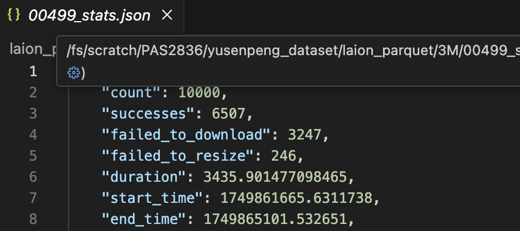

# DTP-ViT: Dynamic Token Pooling Vision Transformer for Efficient Contrastive Pretraining

## DTP-ViT v.s. existing work

| design | approach summary |
| ------ | -------------------------- |
| **DTP-ViT** (ours!) | a single boundary predictor using **Gumbel-Sigmoid** |
| DynamicViT (2021) | a binary decision mask to **PRUNE** tokens at each transformer layer |
| TokenLearner (2021) | a spatial attention module inserted in ViT to **LEARN** tokens |  
| NativeSegViT (2025) | kmeans-like clustering to dynamically **GROUP** tokens repeatedly |

According to DTP paper, both **Gumbel-Sigmoid** and **Entropy-Spike** are very suitable to adapt to other modalities:


## DTP-ViT Architecture

fixed a bug ✅: **boundary loss** was NOT included in training objective (like not going through back propagation)

```txt
Train Epoch: 0 [ 616448/3014656 (20%)] ... Contrastive_loss: 6.7620 (7.1868) Boundary_loss: 0.78544 (0.58045) Loss: 7.5474 (7.7673)
```

```txt
input sequence
     ↓
embedding (dropout)
     ↓
pre-layers (# is a HP, 2 default)
     ↓
boundary predictor (MLP)
     ↓
downsampling 
     ↓
shortened-layers (# is a HP, 10 default)
     ↓
pooling
     ↓
dense
     ↓
embeddings ready for contrastive learning
```

## Performance Metrics

Top-1 Acc (%) and Top-5 Acc (%) on ImageNet zero-shot

## Efficiency Metrics

1. GFLOPs: a different script (adapted from **DynamicViT**), NOT during training
     1. a **pretrained** ViT-B-32 is used to compute FLOPs for ViT-B-32
     2. important Adaptations from DynamicViT:
          [FLOP measurement](https://github.com/raoyongming/DynamicViT/blob/master/calc_flops.py)
          [simulating artificial bounddaries for DynamicViT](https://github.com/raoyongming/DynamicViT/blob/master/models/dylvvit.py)

2. GPU memory and training step time are averaged for each epoch.
     1. memory: torch.cuda.max_memory_allocated()
     2. training step time: **already built-in** by CLIP!

**IMPORTANT** observation:
1. the first epoch takes **longer** time than the following epochs: example - 1.428s, 0.641s, 0.608s, 0.609s, 0.615s...

## TRAINING FROM SCRATCH

### preparation - training from scratch

| preparation strategy | ideal? |
| -------- | ------ |
| stream **HuggingFace** dataset for local download with single process | ❌: slow, impossible to use |
| stream **HuggingFace** dataset for local download with multi-processing | ⚠️: still suboptimal, I/O bottleneck |
| stream arbitrary number of samples **"on the fly"** during training | 🤡: NASTY, slow down training by too much |
| use **img2dataset** to extract | ✅: the best solution so far |

### 3,379,082 - 3M subset from [relaion2B-en-research-safe](https://huggingface.co/datasets/laion/relaion2B-en-research-safe) using my [custom script](/scripts/img2dataset_download.sh)

| model | GFLOPs (fvcore) | resolution | patch size | #epochs | Top-1 Acc (%) | Top-5 Acc (%) | avg GPU memory (GB) | avg training step time (s) |
| ------- | ----- | --------------- | ---------- | -------- | ---------- | ---------------- | ------------- | ---------- |
| ViT-B-32 | 2.96 | 224 | 32 | **12** | **8.46%** | 21.45% | 20.1 | 0.762 |
| 10x comp | 1.25 | 224 | 32 | **12** | **7.32%** | 19.15% | 19.2 | 0.755 |
| ViT-B-32 | 2.96 | 224 | 32 | **22** | **8.46%** | 21.26% | 20.1 | 0.742 |
| 10x comp | 1.25 | 224 | 32 | **22** | **7.07%** | 18.57% | 19.3 | 0.762 |

Note:
1. batch size = 512
2. only ~65% success rate


### full CC12M (only 7,647,569 - 7M USABLE samples) from img2dataset [official script](https://github.com/rom1504/img2dataset/blob/main/dataset_examples/cc12m.md)

| model | GFLOPs (fvcore) | resolution | patch size | #epochs | Top-1 Acc (%) | Top-5 Acc (%) | avg GPU memory (GB) | avg training step time (s) |
| ------- | ----- | --------------- | ---------- | -------- | ---------- | ---------------- | ------------- | ---------- |
| 10x comp | 1.25 | 224 | 32 | **2** | **running** | running | running | running |

### LAION-400M (only ? - ?M USABLE samples) from img2dataset [official script](https://github.com/rom1504/img2dataset/blob/main/dataset_examples/laion400m.md)

coming soon!

## FINETUNING ON IMAGENET-1K

### zero-shot performance of pretrained CLIPs as reference

| pretrained vision encoder | corresponding dataset | zero-shot dataset | zero-shot top-1 |
| ------------------------- | --------------------- | ----------------- | --------------- |
| ViT-B-32 | laion400m_e31 | ImageNet-1K | **60.22%** |
| ViT-B-32 | laion2b_s34b_b79k | ImageNet-1K | **66.53%** |

### finetune CLIP-pretrained ViTs on ImageNet-1K (1.28M images)

| model | dataset pretrained on | freeze the backbone? | batch size | epoch | zero-shot (as reference) | classification accuracy |
| ----- | --------------------- | -------------------- | ---------- | ----- | ------------------------ | ------------ |
| ViT-B-32 | laion2b_s34b_b79k | **yes** | 512 | 1 | 66.53% | 👍🏻**67.73%** |
| 10x compression | **naively** load ALL weights from ViT-B-32 | **yes** | 128 | 1 | 66.53% | 🤡1.46% |
| 10x compression | no initialization (ablation) | **yes** | 128 | 1 | 66.53% | 1.43% |
| ViT-B-32 | laion2b_s34b_b79k | finetune all | 512 | 1 | 66.53% | 50.02% (forgetting) |
| 10x compression | **naively** load ALL weights from ViT-B-32 | finetune all | 128 | 1 | 66.53% | 16.24% |
| 10x compression | no initialization (ablation) | finetune all | 128 | 1 | 66.53% | 9.66% |

## So... pretraining from scratch OR just finetuning?

1. existing papers tend to pretraining from scratch: Native Segmentation Vision Transformer is **pretrained from scratch** using contrastive objective for zero-shot segmentation; TokenLearner is also pretrained on with JFT, and then finetuning/zero-shot, etc.
2. if we really want to leverage pretrained ViT-B-32: just can't naively load all the weights! we need smart strategies to do it...
