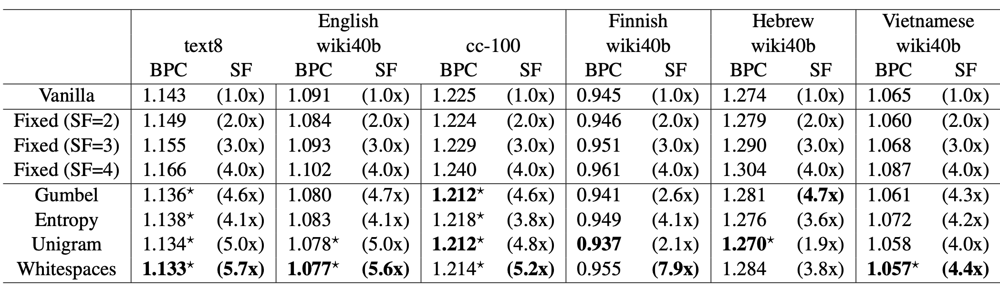

# DTP-ViT: Dynamic Token Pooling Vision Transformer for Efficient Contrastive Pretraining


## Efficiency Metrics

1. GFLOPs: a different script (adapted from **DynamicViT**), NOT during training
     1. a **pretrained** ViT-B-32 is used to compute FLOPs for ViT-B-32
     2. important Adaptations from DynamicViT:
          [FLOP measurement](https://github.com/raoyongming/DynamicViT/blob/master/calc_flops.py)
          [simulating artificial bounddaries for DynamicViT](https://github.com/raoyongming/DynamicViT/blob/master/models/dylvvit.py)

2. GPU memory and training step time are averaged for each epoch.
     1. memory: torch.cuda.max_memory_allocated()
     2. training step time: **already built-in** by CLIP!

Important observation: the first epoch takes **MUCH LONG** time than the following epochs [why?]

## Performance Metrics

Top-1 Acc (%) and Top-5 Acc (%)

Important observation: **STILL NEED MUCH MORE DATA** - ViT-B-32 after 50 epochs:
```
2025-06-08,06:13:34 | INFO | Eval Epoch: 50 imagenet-zeroshot-val-top1: 0.0250	imagenet-zeroshot-val-top5: 0.0813
```

## DTP-ViT results

### 1M subset of LAION-400M - # epochs = 2, batch size = 512

| model | GFLOPs (fvcore) | resolution | patch size | Top-1 Acc (%) | Top-5 Acc (%) | avg GPU memory (GB) | avg training step time (s) |
| ------- | ----- | --------------- | ---------- | ---------- | ---------------- | ------------- | ---------- |
| **ViT-B-32** | 2.96 | 224 | 32 | **1.20%** | **4.55%** | **20.1** | 0.837 |
| **2x compression** | 3.01 | 224 | 32 | 1.03% | 4.27% | 22.0 | 0.699 |
| **4x compression** | 2.32 | 224 | 32 | 0.99% | 4.35% | 21.8 | 0.709 |
| **10x compression** | 1.86 | 224 | 32 | 1.11% | 4.34% | 21.9 | **0.696** |
| **2x, no upsampling** | 2.67 | 224 | 32 | 0.89% | 4.21% | 20.4 | 0.790 |
| **4x, no upsampling** | 1.82 | 224 | 32 | 1.00% | 3.95% | 20.4 | 0.788 |
| **10x, no upsampling** | **1.25** | 224 | 32 | 0.97% | 4.01% | **20.2** | 0.798 |

## DTP-ViT_XL results

### 1M subset of LAION-400M - # epochs = 2, batch size = 512

| model | GFLOPs (fvcore) | resolution | patch size | Top-1 Acc (%) | Top-5 Acc (%) | avg GPU memory (GB) | avg training step time (s) |
| ------- | ----- | --------------- | ---------- | ---------- | ---------------- | ------------- | ---------- |
| **ViT-B-32** | 2.96 | 224 | 32 | **1.20%** | **4.55%** | **20.1** | 0.837 |
| **2x, no upsampling** | 2.67 | 224 | 32 | N/A | N/A | N/A | N/A |
| **4x, no upsampling** | 1.82 | 224 | 32 | N/A | N/A | N/A | N/A |
| **10x, no upsampling** | **1.25** | 224 | 32 | N/A | N/A | N/A | N/A |


## computing resource exploration (Pitzer and Ascend)

| model | batch size | # nodes | # GPUs per node | effective batch size | cluster | partition | fit? |
| ------------ | ---------- | ------ | ---------------------| ------- | ---- | ---- | --- |
| <tr><td colspan="8" align="center"> **single**-GPU </td></tr> |
| ViT-B-32 (88M) | **256** | 1 | 1 | 256 | pitzer | gpuserial | ✅ |
| ViT-B-32 (88M) | 256 | 1 | 1 | 256 | ascend | nextgen | ✅ |
| ViT-B-32 (88M) | 512 | 1 | 1 | 512 | pitzer | gpuserial | ❌ (OOM) |
| ViT-B-32 (88M) | 512 | 1 | 1 | 512 | ascend | nextgen | ✅ | 
| ViT-B-32 (88M) | 1024 | 1 | 1 | 1024 | ascend | nextgen | ✅ | 
| ViT-B-32 (88M) | 2048 | 1 | 1 | 2048 | ascend | nextgen | ❌ (OOM) | 
| ViT-B-16 (86M) | 256 | 1 | 1 | 256 | pitzer | gpuserial | ✅ |
| ViT-B-16 (86M) | 512 | 1 | 1 | 512 | pitzer | gpuserial | ❌ (OOM) |
| ViT-B-16 (88M) | 256 | 1 | 1 | 256 | ascend | nextgen | ✅ | 
| ViT-B-16 (88M) | 512 | 1 | 1 | 512 | ascend | nextgen | ❌ (OOM) |  
| ViT-L-14 (307M) | **32** | 1 | 1 | 32 | pitzer | gpuserial | ✅ |
| ViT-L-14 (307M) | **32** | 1 | 1 | 32 | ascend | nextgen | ✅ |
| ViT-L-14 (307M) | 64 | 1 | 1 | 64 | pitzer | gpuserial | ❌ (OMM) |
| ViT-L-14 (307M) | 64 | 1 | 1 | 64 | ascend | nextgen | ✅ |
| ViT-L-14 (307M) | 128 | 1 | 1 | 128 | ascend | nextgen | ✅ |
| ViT-L-14 (307M) | 256 | 1 | 1 | 256 | ascend | nextgen | ❌ (OMM) |
| <tr><td colspan="8" align="center"> ViT-H-14 (632M) ALWAYS OOM for pitzer </td></tr> |
| ViT-H-14 (632M) | 32 | 1 | 1 | 32 | ascend | nextgen | ✅ |
| ViT-H-14 (632M) | 32 | 1 | 1 | 64 | ascend | nextgen | ❌ (OMM) |
| <tr><td colspan="8" align="center"> **multi**-GPU </td></tr> |
| ViT-B-32 (88M) | 256 | 1 | 2 | 512 | pitzer | gpuserial | ✅ |
| ViT-B-32 (88M) | 256 | 1 | 4 | 1024 | pitzer | gpuserial | ✅ |
| ViT-B-32 (88M) | 256 | 1 | 4 | 1024 | ascend | quad | ✅ |
| ViT-B-32 (88M) | 256 | 1 | 8 | 2048 | pitzer | gpuserial | ❌ (exceed limit) |
| ViT-B-16 (86M) | 256 | 1 | 2 | 512 | pitzer | gpuserial | ✅ |
| ViT-B-16 (86M) | 256 | 1 | 4 | 1024 | pitzer | gpuserial | ✅ |
| ViT-B-16 (86M) | 256 | 1 | 8 | 2048 | pitzer | gpuserial | ❌ (exceed limit) |
| ViT-L-14 (307M) | ***20*** | 1 | 2 | 40 | pitzer | gpuserial | ✅ |
| ViT-L-14 (307M) | 32 | 1 | 2 | 64 | pitzer | gpuserial | ❌ (**OOM, weird...**) |
| <tr><td colspan="8" align="center"> multi-**node** </td></tr> |
| ViT-B-32 (88M) | 256 | 2 | 2 | 1024 | pitzer | gpuparallel-48core | ✅ |
| ViT-B-32 (88M) | 256 | 2 | 4 | 2048 | pitzer | gpuparallel-48core | ✅ |
| ViT-B-32 (88M) | 256 | 4 | 2 | 2048 | pitzer | gpuparallel-48core | ✅ |
| ViT-B-32 (88M) | 256 | 4 | 4 | 4096 | pitzer | gpuparallel-48core | ❌ (Node count) |


## DTP-ViT v.s. baselines/existing work

| design | approach summary |
| ------ | -------------------------- |
| <tr><td colspan="2" align="center"> baseline/existing work </td></tr> |
| DynamicViT | a binary decision mask to **PRUNE** tokens at each transformer layer |
| NativeSegViT | kmeans-like clustering to dynamically **GROUP** tokens repeatedly |
| TokenLearner | a spatial attention module inserted in ViT to **LEARN** tokens |  
| <tr><td colspan="2" align="center"> DTP-ViT </td></tr> |
| DTP-ViT (Gumbel-Sigmoid) | a boundary predictor using Gumbel-Sigmoid |
| DTP-ViT (entropy-spikes) | a boundary predictor supervised by entropy spikes |

## train a CLIP from scratch

| pretraining dataset | zero-shot dataset | image encoder | text encoder | # epochs | zero-shot top-1 | zero-shot top-5 | more HPs |
| ------------ | ------------- | ------------------- | ----------------- | -------- | --------------- | --------------- | -------- |
| <tr><td colspan="8" align="center"> Toy experiments </td></tr> |
| COCO (2014), 82k train, 40k val | ImageNet (2012), 50k val | RN50 | transformer | 1 | 0.94% | 3.38% | [HPs](training_plan/COCO_0.json) |
| COCO (2014), 82k train, 40k val | ImageNet (2012), 50k val | RN50 | transformer | 10 | 1.50% | 4.94% | [HPs](training_plan/COCO_2.json) |
| COCO (2014), 82k train, 40k val | ImageNet (2012), 50k val | RN50 | transformer | 30 | 1.75% | 5.41% | [HPs](training_plan/COCO_3.json) |
| LAION-400M (2021), 80k train, 20k val | ImageNet (2012), 50k val | RN50 | transformer | 1 | 0.27% | 1.29% | [HPs](training_plan/COCO_1.json) |
| LAION-400M (2021), 80k train, 20k val | ImageNet (2012), 50k val | RN50 | transformer | 10 | 0.40% | 1.95% | [HPs](training_plan/COCO_2.json) |
| LAION-400M (2021), 80k train, 20k val | ImageNet (2012), 50k val | RN50 | transformer | 30 | 0.50% | 2.09% | [HPs](training_plan/COCO_3.json) |


## evaluate a pretrained CLIP

| pretrained vision encoder | corresponding dataset | zero-shot dataset | zero-shot top-1 | zero-shot top-5 |
| ------------------------- | --------------------- | ----------------- | --------------- | --------------- |
| RN50x16 | openai | ImageNet (2012), 50k val | 70.14% | 92.41% |
| ViT-B-32 (88M) | laion2b_s34b_b79k | ImageNet (2012), 50k val | 66.53% | 89.89% |
| ViT-B-16 (86M) | laion2b_s34b_b88k | ImageNet (2012), 50k val | 70.21% | 91.76% |
| ViT-L-14 (307M) | laion2b_s32b_b82k | ImageNet (2012), 50k val | 75.26% | 94.25% | 

## Baseline: DynamicViT

motivation: Dynamic Token Sparsification > Structural Downsampling
results: good **trade-offs** between model complexity (FLOPs) and top-1 accuracy on ImageNet

```txt
input sequence
     ↓
-----------------------------------
basic transformer layer
     ↓
binary decision mask 
     goal: prune less-informative tokens
     end-to-end training: Gumbel-Softmax
     pruning: attention masking by constructing a graph
-----------------------------------
     ↓
    ... (repeat)
     ↓
    ...
```

Note: G(ij) = 1 means the j-th token will contribute to the update of the i-th token:


### Training Objective


1. classification loss: cross entropy
2. distillation loss (token alignment) + KL divergence Loss (prediction alignment): teacher-student setup
3. prune ratio regularization: constrain the ratio of the kept tokens to a **predefined** value

## Another Baseline: Native Segmentation ViT

motivation: content-aware **spatial grouping layer** > uniform downsampling

```txt
input sequence
     ↓
patch embedding
     ↓
-------------------------------
local grouping layer (repeat 2 times)
     a differentiable (soft) Kmeans-like clustering
     initialize "centroids" (output tokens) with a strided convolution over the input tokens
     "local": each output token only attends to a 3x3 local window of input tokens
-------------------------------
     ↓
-------------------------------
dense grouping layer
     "dense": every output token attends to all input tokens
-------------------------------
```

## Another Baseline: TokenLearner

motivation: adaptive tokenization + reduces the total number of tokens

```txt
input sequence
     ↓
transformer layer
     ↓
----------------------------------
spatial attention (see below)
     ↓
learned tokens (significantly less)
----------------------------------
     ↓
transformer layer
     ↓
transformer layer
     ↓
    ... (proceed with ViT)
```


1. Xt: a frame
2. alpha: convolution/MLP
3. rho: spatial global average pooling

## Our approach: DTP-ViT

```txt
input sequence
     ↓
embedding (dropout)
     ↓
pre-layers (# is a HP, 2 from the paper)
     ↓
boundary predictor (MLP)
     ↓
downsampling 
     ↓
shortened-layers (# is a HP, 8 from the paper)
     ↓
upsampling
     ↓
post-layers (# is a HP, 2 from the paper)
     ↓
final dense

Note: the layer split from the paper is 2 (pre) + 8 (shortened) + 2 (post)
```

### Training Objective

Language Model Loss: cross-entropy

Boundary Loss: pick one from below:

| loss type | illustration | supervised? |
| --------- | ------------ | ----------- |
| entropy spikes |  | yes |
| unigram tokenizer | omitted | yes | 
| Gumbel Sigmoid |  | no |

### DTP training (text/language)

| dataset | training target length | training max step | Bits-per-character (BPC) |
| ------- | ---------------------- | ----------------- | ------------------------ |
| text8 | 512 | 10,000 | 1.46513 |
| text8 | 512 | 100,000 | 1.22651 |

## DTP results

BPC (Bits Per Character) and SF (average Shortening Factor):



SF (average Shortening Factor) and reduction in GPU memory and Training step time:


## Commands to run experiment

Evaluating a pretrained CLIP:

```bash
salloc --nodes=1 --ntasks-per-node=1 --gpus-per-node=1 -A PAS2836 --time 0:15:00
module load miniconda3/24.1.2-py310
conda deactivate
conda activate Fast-CLIP
python src/eval_CLIP.py

```

Training a CLIP from scratch:

```bash
module load miniconda3
conda deactivate
sbatch ./real_run.sh

```

Training a DTP from scratch:

```bash
module load miniconda3
conda deactivate
sbatch ./dtp_run.sh

```

Monitor my jobs:

```bash
squeue -u yusenpeng
```

More details:

```bash
scontrol show job [JOB_ID]
```

to early cancel a job (something is already wrong)

```bash
scancel [JOB_ID]
```

look up all partitions on a cluster

```bash
sinfo -o "%P"
```


## unzip datasets

```bash
unzip filename.zip -x "__MACOSX/*" "*.DS_Store"
```

## Environment Setup

```bash
conda create -n Fast-CLIP python=3.11
conda activate Fast-CLIP
python -m pip install open_clip_torch
python -m pip install 'open_clip_torch[training]'
conda install -c conda-forge sentencepiece
python -m pip install braceexpand
python -m pip install webdataset
python -m pip install tensorboard
python -m pip install pdbpp
```
