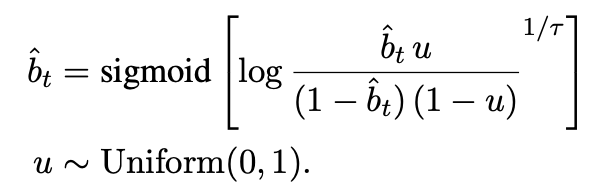

# Fast-CLIP: Efficient Contrastive Pretraining with Dynamic Token Pooling

use dynamic token pooling for image and text encoders in CLIP to boost efficiency (potentially we combine it with *mini-techniques* like quantization, pruning, or distillation, etc.)

## train a CLIP from scratch

| pretraining dataset | zero-shot dataset | image encoder | text encoder | # epochs | zero-shot top-1 | zero-shot top-5 | more HPs |
| ------------ | ------------- | ------------------- | ----------------- | -------- | --------------- | --------------- | -------- |
| COCO (2014), 82k train, 40k val | ImageNet (2012), 50k val | RN50 | transformer | 1 | 0.94% | 3.38% | [HPs](training_plan/COCO_0.json) |
| COCO (2014), 82k train, 40k val | ImageNet (2012), 50k val | RN50 | transformer | 10 | 1.50% | 4.94% | [HPs](training_plan/COCO_2.json) |
| COCO (2014), 82k train, 40k val | ImageNet (2012), 50k val | RN50 | transformer | 30 | 1.75% | 5.41% | [HPs](training_plan/COCO_3.json) |
| LAION-400M (2021), 80k train, 20k val | ImageNet (2012), 50k val | RN50 | transformer | 1 | 0.27% | 1.29% | [HPs](training_plan/COCO_1.json) |
| LAION-400M (2021), 80k train, 20k val | ImageNet (2012), 50k val | RN50 | transformer | 10 | 0.40% | 1.95% | [HPs](training_plan/COCO_2.json) |
| LAION-400M (2021), 80k train, 20k val | ImageNet (2012), 50k val | RN50 | transformer | 30 | 0.50% | 2.09% | [HPs](training_plan/COCO_3.json) |


### DTP training

| dataset | training target length | training max step | Bits-per-character (BPC) |
| ------- | ---------------------- | ----------------- | ------------------------ |
| text8 | 512 | 10,000 | 1.46513 |
| text8 | 512 | 100,000 | 1.22651 |

## Unit inference

```bash
python src/unit_inference_CLIP.py
```

## Dynamic Token Pooling

### model architecture

```txt
input sequence
     ↓
embedding (dropout)
     ↓
pre-layers (# is a HP)
     ↓
boundary predictor (MLP)
     ↓
downsampling 
     ↓
shortened-layers (# is a HP)
     ↓
upsampling
     ↓
post-layers (# is a HP)
     ↓
final dense
```

### Training Objective:

Language Model Loss: cross-entropy

Boundary Loss: pick one from below:

| loss type | illustration | supervised? |
| --------- | ------------ | ----------- |
| entropy spikes |  | yes |
| unigram tokenizer | omitted | yes | 
| Gumbel Sigmoid |  | no |

## Environment Setup

```bash
conda create -n Fast-CLIP python=3.11
conda activate Fast-CLIP
python -m pip install open_clip_torch
python -m pip install 'open_clip_torch[training]'
conda install -c conda-forge sentencepiece
python -m pip install braceexpand
python -m pip install webdataset
python -m pip install tensorboard
python -m pip install pdbpp
```

OSC-specific commands:

schedule a job from the project **PAS2836**:

Debugging (in interactive mode, schedule 10 mins):

```bash
salloc --nodes=1 --ntasks-per-node=1 --gpus-per-node=1 -A PAS2836 --time 0:20:00
module load miniconda3
conda deactivate
conda activate Fast-CLIP
python src/train_CLIP.py

```

Running Experiments:

```bash
module load miniconda3
conda deactivate
sbatch ./real_run.sh
```

or
```bash
module load miniconda3
conda deactivate
sbatch ./dtp_run.sh
```

Monitor my jobs:

```bash
squeue -u yusenpeng
```

to early cancel a job (something is already wrong)

```bash
scancel [JOB_ID]
```

## unzip datasets

```bash
unzip filename.zip -x "__MACOSX/*" "*.DS_Store"
```
