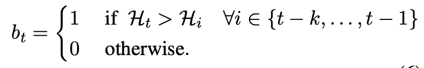
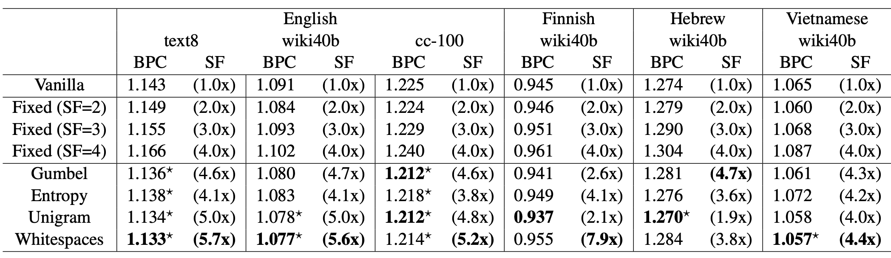
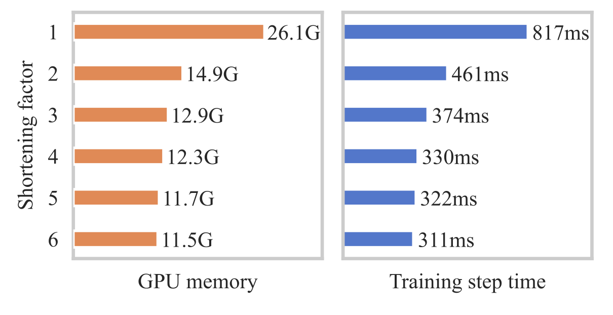
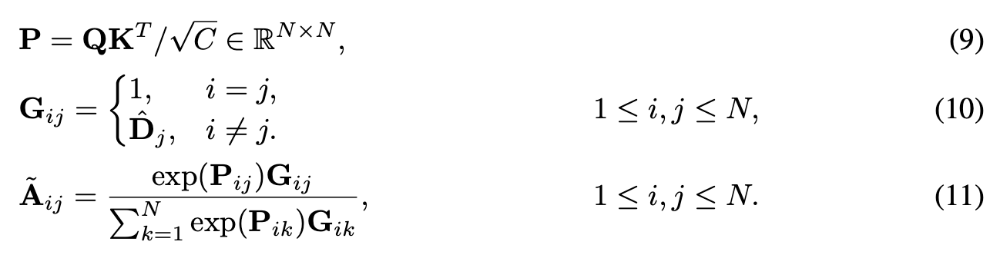
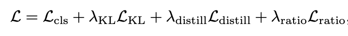
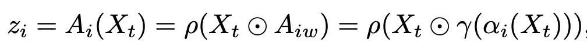

# Related Work (exploration, baseline, etc.)

## computing resource exploration (Pitzer and Ascend)

| model | batch size | # nodes | # GPUs per node | effective batch size | cluster | partition | fit? |
| ------------ | ---------- | ------ | ---------------------| ------- | ---- | ---- | --- |
| <tr><td colspan="8" align="center"> **single**-GPU </td></tr> |
| ViT-B-32 (88M) | **256** | 1 | 1 | 256 | pitzer | gpuserial | ✅ |
| ViT-B-32 (88M) | 256 | 1 | 1 | 256 | ascend | nextgen | ✅ |
| ViT-B-32 (88M) | 512 | 1 | 1 | 512 | pitzer | gpuserial | ❌ (OOM) |
| ViT-B-32 (88M) | 512 | 1 | 1 | 512 | ascend | nextgen | ✅ | 
| ViT-B-32 (88M) | 1024 | 1 | 1 | 1024 | ascend | nextgen | ✅ | 
| ViT-B-32 (88M) | 2048 | 1 | 1 | 2048 | ascend | nextgen | ❌ (OOM) | 
| ViT-B-16 (86M) | 256 | 1 | 1 | 256 | pitzer | gpuserial | ✅ |
| ViT-B-16 (86M) | 512 | 1 | 1 | 512 | pitzer | gpuserial | ❌ (OOM) |
| ViT-B-16 (88M) | 256 | 1 | 1 | 256 | ascend | nextgen | ✅ | 
| ViT-B-16 (88M) | 512 | 1 | 1 | 512 | ascend | nextgen | ❌ (OOM) |  
| ViT-L-14 (307M) | **32** | 1 | 1 | 32 | pitzer | gpuserial | ✅ |
| ViT-L-14 (307M) | **32** | 1 | 1 | 32 | ascend | nextgen | ✅ |
| ViT-L-14 (307M) | 64 | 1 | 1 | 64 | pitzer | gpuserial | ❌ (OMM) |
| ViT-L-14 (307M) | 64 | 1 | 1 | 64 | ascend | nextgen | ✅ |
| ViT-L-14 (307M) | 128 | 1 | 1 | 128 | ascend | nextgen | ✅ |
| ViT-L-14 (307M) | 256 | 1 | 1 | 256 | ascend | nextgen | ❌ (OMM) |
| <tr><td colspan="8" align="center"> ViT-H-14 (632M) ALWAYS OOM for pitzer </td></tr> |
| ViT-H-14 (632M) | 32 | 1 | 1 | 32 | ascend | nextgen | ✅ |
| ViT-H-14 (632M) | 32 | 1 | 1 | 64 | ascend | nextgen | ❌ (OMM) |
| <tr><td colspan="8" align="center"> **multi**-GPU </td></tr> |
| ViT-B-32 (88M) | 256 | 1 | 2 | 512 | pitzer | gpuserial | ✅ |
| ViT-B-32 (88M) | 256 | 1 | 4 | 1024 | pitzer | gpuserial | ✅ |
| ViT-B-32 (88M) | 256 | 1 | 4 | 1024 | ascend | quad | ✅ |
| ViT-B-32 (88M) | 256 | 1 | 8 | 2048 | pitzer | gpuserial | ❌ (exceed limit) |
| ViT-B-16 (86M) | 256 | 1 | 2 | 512 | pitzer | gpuserial | ✅ |
| ViT-B-16 (86M) | 256 | 1 | 4 | 1024 | pitzer | gpuserial | ✅ |
| ViT-B-16 (86M) | 256 | 1 | 8 | 2048 | pitzer | gpuserial | ❌ (exceed limit) |
| ViT-L-14 (307M) | ***20*** | 1 | 2 | 40 | pitzer | gpuserial | ✅ |
| ViT-L-14 (307M) | 32 | 1 | 2 | 64 | pitzer | gpuserial | ❌ (**OOM, weird...**) |
| <tr><td colspan="8" align="center"> multi-**node** </td></tr> |
| ViT-B-32 (88M) | 256 | 2 | 2 | 1024 | pitzer | gpuparallel-48core | ✅ |
| ViT-B-32 (88M) | 256 | 2 | 4 | 2048 | pitzer | gpuparallel-48core | ✅ |
| ViT-B-32 (88M) | 256 | 4 | 2 | 2048 | pitzer | gpuparallel-48core | ✅ |
| ViT-B-32 (88M) | 256 | 4 | 4 | 4096 | pitzer | gpuparallel-48core | ❌ (Node count) |

## train a CLIP from scratch

| pretraining dataset | zero-shot dataset | image encoder | text encoder | # epochs | zero-shot top-1 | zero-shot top-5 | more HPs |
| ------------ | ------------- | ------------------- | ----------------- | -------- | --------------- | --------------- | -------- |
| <tr><td colspan="8" align="center"> Toy experiments </td></tr> |
| COCO (2014), 82k train, 40k val | ImageNet (2012), 50k val | RN50 | transformer | 1 | 0.94% | 3.38% | [HPs](training_plan/COCO_0.json) |
| COCO (2014), 82k train, 40k val | ImageNet (2012), 50k val | RN50 | transformer | 10 | 1.50% | 4.94% | [HPs](training_plan/COCO_2.json) |
| COCO (2014), 82k train, 40k val | ImageNet (2012), 50k val | RN50 | transformer | 30 | 1.75% | 5.41% | [HPs](training_plan/COCO_3.json) |
| LAION-400M (2021), 80k train, 20k val | ImageNet (2012), 50k val | RN50 | transformer | 1 | 0.27% | 1.29% | [HPs](training_plan/COCO_1.json) |
| LAION-400M (2021), 80k train, 20k val | ImageNet (2012), 50k val | RN50 | transformer | 10 | 0.40% | 1.95% | [HPs](training_plan/COCO_2.json) |
| LAION-400M (2021), 80k train, 20k val | ImageNet (2012), 50k val | RN50 | transformer | 30 | 0.50% | 2.09% | [HPs](training_plan/COCO_3.json) |

## Efficient Transformer with Dynamic Token Pooling

### DTP Training Objective

Language Model Loss: cross-entropy

Boundary Loss: pick one from below:

| loss type | illustration | supervised? |
| --------- | ------------ | ----------- |
| entropy spikes |  | yes |
| unigram tokenizer | omitted | yes | 
| Gumbel Sigmoid |  | no |

### DTP training (text/language)

| dataset | training target length | training max step | Bits-per-character (BPC) |
| ------- | ---------------------- | ----------------- | ------------------------ |
| text8 | 512 | 10,000 | 1.46513 |
| text8 | 512 | 100,000 | 1.22651 |

## DTP results

BPC (Bits Per Character) and SF (average Shortening Factor):



SF (average Shortening Factor) and reduction in GPU memory and Training step time:




## Baseline 1: DynamicViT

motivation: Dynamic Token Sparsification > Structural Downsampling
results: good **trade-offs** between model complexity (FLOPs) and top-1 accuracy on ImageNet

```txt
input sequence
     ↓
-----------------------------------
basic transformer layer
     ↓
binary decision mask 
     goal: prune less-informative tokens
     end-to-end training: Gumbel-Softmax
     pruning: attention masking by constructing a graph
-----------------------------------
     ↓
    ... (repeat)
     ↓
    ...
```

Note: G(ij) = 1 means the j-th token will contribute to the update of the i-th token:



### Training Objective



1. classification loss: cross entropy
2. distillation loss (token alignment) + KL divergence Loss (prediction alignment): teacher-student setup
3. prune ratio regularization: constrain the ratio of the kept tokens to a **predefined** value

## Baseline 2: Native Segmentation ViT

motivation: content-aware **spatial grouping layer** > uniform downsampling

```txt
input sequence
     ↓
patch embedding
     ↓
-------------------------------
local grouping layer (repeat 2 times)
     a differentiable (soft) Kmeans-like clustering
     initialize "centroids" (output tokens) with a strided convolution over the input tokens
     "local": each output token only attends to a 3x3 local window of input tokens
-------------------------------
     ↓
-------------------------------
dense grouping layer
     "dense": every output token attends to all input tokens
-------------------------------
```

## Baseline 3: TokenLearner

motivation: adaptive tokenization + reduces the total number of tokens

```txt
input sequence
     ↓
transformer layer
     ↓
----------------------------------
spatial attention (see below)
     ↓
learned tokens (significantly less)
----------------------------------
     ↓
transformer layer
     ↓
transformer layer
     ↓
    ... (proceed with ViT)
```



1. Xt: a frame
2. alpha: convolution/MLP
3. rho: spatial global average pooling


## DTP-ViT-XL results

### 1M subset of LAION-400M - # epochs = 2, batch size = 512

| model | GFLOPs (fvcore) | resolution | patch size | Top-1 Acc (%) | Top-5 Acc (%) | avg GPU memory (GB) | avg training step time (s) |
| ------- | ----- | --------------- | ---------- | ---------- | ---------------- | ------------- | ---------- |
| **ViT-B-32** | 2.96 | 224 | 32 | **1.20%** | **4.55%** | **20.1** | 0.837 |
| **2x, no upsampling** | 2.89 | 224 | 32 | 0.93% | 3.74% | 20.4 | 0.683 |
| **4x, no upsampling** | 1.96 | 224 | 32 | 1.01% | 3.87% | 20.9 | 0.861 |
| **10x, no upsampling** | 1.34 | 224 | 32 | 0.98% | 3.80% | 21.0 | 0.675 |
