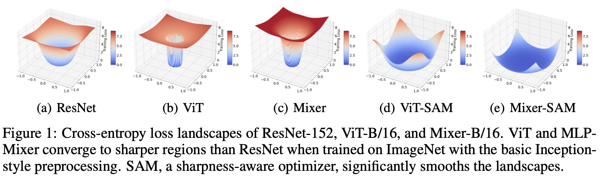
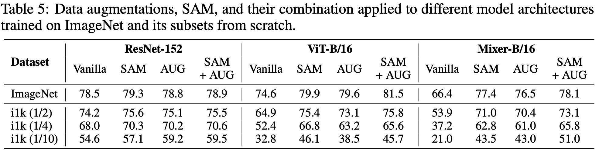
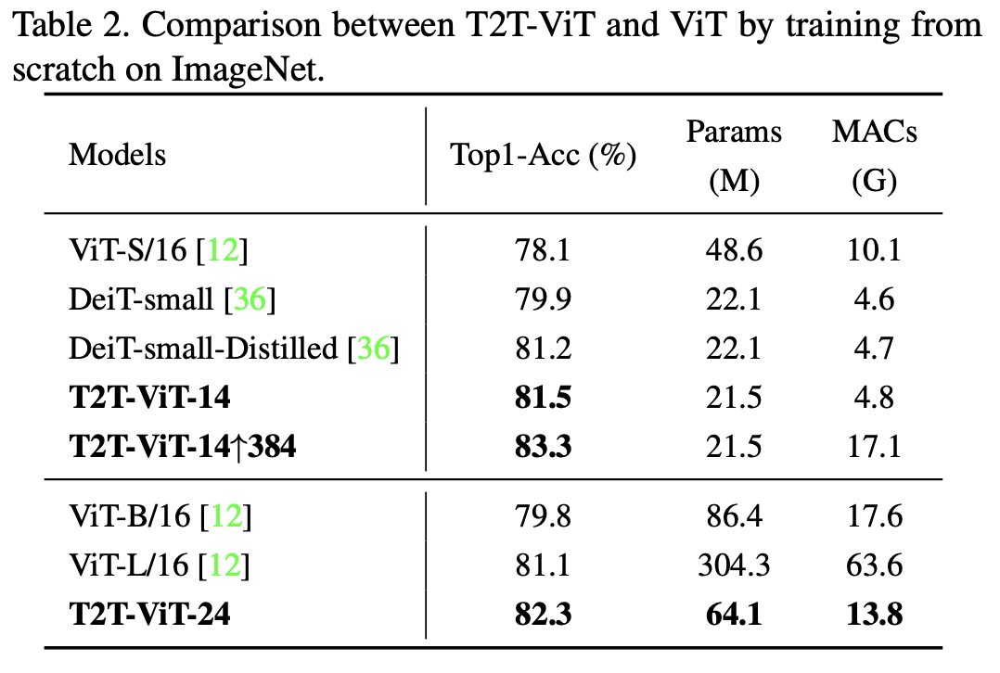

# Related Work (exploration, baseline, etc.)

## computing resource exploration (Pitzer and Ascend)

| model | batch size | # nodes | # GPUs per node | effective batch size | cluster | partition | fit? |
| ------------ | ---------- | ------ | ---------------------| ------- | ---- | ---- | --- |
| <tr><td colspan="8" align="center"> **single**-GPU </td></tr> |
| ViT-B-32 (88M) | **256** | 1 | 1 | 256 | pitzer | gpuserial | ✅ |
| ViT-B-32 (88M) | 256 | 1 | 1 | 256 | ascend | nextgen | ✅ |
| ViT-B-32 (88M) | 512 | 1 | 1 | 512 | pitzer | gpuserial | ❌ (OOM) |
| ViT-B-32 (88M) | 512 | 1 | 1 | 512 | ascend | nextgen | ✅ | 
| ViT-B-32 (88M) | 1024 | 1 | 1 | 1024 | ascend | nextgen | ✅ | 
| ViT-B-32 (88M) | 2048 | 1 | 1 | 2048 | ascend | nextgen | ❌ (OOM) | 
| ViT-B-16 (86M) | 256 | 1 | 1 | 256 | pitzer | gpuserial | ✅ |
| ViT-B-16 (86M) | 512 | 1 | 1 | 512 | pitzer | gpuserial | ❌ (OOM) |
| ViT-B-16 (88M) | 256 | 1 | 1 | 256 | ascend | nextgen | ✅ | 
| ViT-B-16 (88M) | 512 | 1 | 1 | 512 | ascend | nextgen | ❌ (OOM) |  
| ViT-L-14 (307M) | **32** | 1 | 1 | 32 | pitzer | gpuserial | ✅ |
| ViT-L-14 (307M) | **32** | 1 | 1 | 32 | ascend | nextgen | ✅ |
| ViT-L-14 (307M) | 64 | 1 | 1 | 64 | pitzer | gpuserial | ❌ (OMM) |
| ViT-L-14 (307M) | 64 | 1 | 1 | 64 | ascend | nextgen | ✅ |
| ViT-L-14 (307M) | 128 | 1 | 1 | 128 | ascend | nextgen | ✅ |
| ViT-L-14 (307M) | 256 | 1 | 1 | 256 | ascend | nextgen | ❌ (OMM) |
| <tr><td colspan="8" align="center"> ViT-H-14 (632M) ALWAYS OOM for pitzer </td></tr> |
| ViT-H-14 (632M) | 32 | 1 | 1 | 32 | ascend | nextgen | ✅ |
| ViT-H-14 (632M) | 32 | 1 | 1 | 64 | ascend | nextgen | ❌ (OMM) |
| <tr><td colspan="8" align="center"> **multi**-GPU </td></tr> |
| ViT-B-32 (88M) | 256 | 1 | 2 | 512 | pitzer | gpuserial | ✅ |
| ViT-B-32 (88M) | 256 | 1 | 4 | 1024 | pitzer | gpuserial | ✅ |
| ViT-B-32 (88M) | 256 | 1 | 4 | 1024 | ascend | quad | ✅ |
| ViT-B-32 (88M) | 256 | 1 | 8 | 2048 | pitzer | gpuserial | ❌ (exceed limit) |
| ViT-B-16 (86M) | 256 | 1 | 2 | 512 | pitzer | gpuserial | ✅ |
| ViT-B-16 (86M) | 256 | 1 | 4 | 1024 | pitzer | gpuserial | ✅ |
| ViT-B-16 (86M) | 256 | 1 | 8 | 2048 | pitzer | gpuserial | ❌ (exceed limit) |
| ViT-L-14 (307M) | ***20*** | 1 | 2 | 40 | pitzer | gpuserial | ✅ |
| ViT-L-14 (307M) | 32 | 1 | 2 | 64 | pitzer | gpuserial | ❌ (**OOM, weird...**) |
| <tr><td colspan="8" align="center"> multi-**node** </td></tr> |
| ViT-B-32 (88M) | 256 | 2 | 2 | 1024 | pitzer | gpuparallel-48core | ✅ |
| ViT-B-32 (88M) | 256 | 2 | 4 | 2048 | pitzer | gpuparallel-48core | ✅ |
| ViT-B-32 (88M) | 256 | 4 | 2 | 2048 | pitzer | gpuparallel-48core | ✅ |
| ViT-B-32 (88M) | 256 | 4 | 4 | 4096 | pitzer | gpuparallel-48core | ❌ (Node count) |

## train a CLIP from scratch

| pretraining dataset | zero-shot dataset | image encoder | text encoder | # epochs | zero-shot top-1 | zero-shot top-5 | more HPs |
| ------------ | ------------- | ------------------- | ----------------- | -------- | --------------- | --------------- | -------- |
| <tr><td colspan="8" align="center"> Toy experiments </td></tr> |
| COCO (2014), 82k train, 40k val | ImageNet (2012), 50k val | RN50 | transformer | 1 | 0.94% | 3.38% | [HPs](training_plan/COCO_0.json) |
| COCO (2014), 82k train, 40k val | ImageNet (2012), 50k val | RN50 | transformer | 10 | 1.50% | 4.94% | [HPs](training_plan/COCO_2.json) |
| COCO (2014), 82k train, 40k val | ImageNet (2012), 50k val | RN50 | transformer | 30 | 1.75% | 5.41% | [HPs](training_plan/COCO_3.json) |
| LAION-400M (2021), 80k train, 20k val | ImageNet (2012), 50k val | RN50 | transformer | 1 | 0.27% | 1.29% | [HPs](training_plan/COCO_1.json) |
| LAION-400M (2021), 80k train, 20k val | ImageNet (2012), 50k val | RN50 | transformer | 10 | 0.40% | 1.95% | [HPs](training_plan/COCO_2.json) |
| LAION-400M (2021), 80k train, 20k val | ImageNet (2012), 50k val | RN50 | transformer | 30 | 0.50% | 2.09% | [HPs](training_plan/COCO_3.json) |

## Efficient Transformer with Dynamic Token Pooling

### DTP Training Objective

Language Model Loss: cross-entropy

Boundary Loss: pick one from below:

| loss type | illustration | supervised? |
| --------- | ------------ | ----------- |
| entropy spikes |  | yes |
| unigram tokenizer | omitted | yes | 
| Gumbel Sigmoid |  | no |

### DTP training (text/language)

| dataset | training target length | training max step | Bits-per-character (BPC) |
| ------- | ---------------------- | ----------------- | ------------------------ |
| text8 | 512 | 10,000 | 1.46513 |
| text8 | 512 | 100,000 | 1.22651 |

## DTP results

BPC (Bits Per Character) and SF (average Shortening Factor):


SF (average Shortening Factor) and reduction in GPU memory and Training step time:


## Baseline 1: DynamicViT

motivation: Dynamic Token Sparsification > Structural Downsampling
results: good **trade-offs** between model complexity (FLOPs) and top-1 accuracy on ImageNet

```txt
input sequence
     ↓
-----------------------------------
basic transformer layer
     ↓
binary decision mask 
     goal: prune less-informative tokens
     end-to-end training: Gumbel-Softmax
     pruning: attention masking by constructing a graph
-----------------------------------
     ↓
    ... (repeat)
     ↓
    ...
```

Note: G(ij) = 1 means the j-th token will contribute to the update of the i-th token:


### Training Objective


1. classification loss: cross entropy
2. distillation loss (token alignment) + KL divergence Loss (prediction alignment): teacher-student setup
3. prune ratio regularization: constrain the ratio of the kept tokens to a **predefined** value

## Baseline 2: Native Segmentation ViT

motivation: content-aware **spatial grouping layer** > uniform downsampling

```txt
input sequence
     ↓
patch embedding
     ↓
-------------------------------
local grouping layer (repeat 2 times)
     a differentiable (soft) Kmeans-like clustering
     initialize "centroids" (output tokens) with a strided convolution over the input tokens
     "local": each output token only attends to a 3x3 local window of input tokens
-------------------------------
     ↓
-------------------------------
dense grouping layer
     "dense": every output token attends to all input tokens
-------------------------------
```

## Baseline 3: TokenLearner

motivation: adaptive tokenization + reduces the total number of tokens

```txt
input sequence
     ↓
transformer layer
     ↓
----------------------------------
spatial attention (see below)
     ↓
learned tokens (significantly less)
----------------------------------
     ↓
transformer layer
     ↓
transformer layer
     ↓
    ... (proceed with ViT)
```


1. Xt: a frame
2. alpha: convolution/MLP
3. rho: spatial global average pooling


## DTP-ViT-XL results

### 1M subset of LAION-400M - # epochs = 2, batch size = 512

| model | GFLOPs (fvcore) | resolution | patch size | Top-1 Acc (%) | Top-5 Acc (%) | avg GPU memory (GB) | avg training step time (s) |
| ------- | ----- | --------------- | ---------- | ---------- | ---------------- | ------------- | ---------- |
| **ViT-B-32** | 2.96 | 224 | 32 | **1.20%** | **4.55%** | **20.1** | 0.837 |
| **2x, no upsampling** | 2.89 | 224 | 32 | 0.93% | 3.74% | 20.4 | 0.683 |
| **4x, no upsampling** | 1.96 | 224 | 32 | 1.01% | 3.87% | 20.9 | 0.861 |
| **10x, no upsampling** | 1.34 | 224 | 32 | 0.98% | 3.80% | 21.0 | 0.675 |

### 1M subset of LAION - # epochs = 2, batch size = 512

| model | GFLOPs (fvcore) | resolution | patch size | Top-1 Acc (%) | Top-5 Acc (%) | avg GPU memory (GB) | avg training step time (s) |
| ------- | ----- | --------------- | ---------- | ---------- | ---------------- | ------------- | ---------- |
| **ViT-B-32** | 2.96 | 224 | 32 | **1.20%** | **4.55%** | **20.1** | 0.837 |
| **2x compression** | 3.01 | 224 | 32 | 1.03% | 4.27% | 22.0 | 0.699 |
| **4x compression** | 2.32 | 224 | 32 | 0.99% | 4.35% | 21.8 | 0.709 |
| **10x compression** | 1.86 | 224 | 32 | 1.11% | 4.34% | 21.9 | **0.696** |
| **2x, no upsampling** | 2.67 | 224 | 32 | 0.89% | 4.21% | 20.4 | 0.790 |
| **4x, no upsampling** | 1.82 | 224 | 32 | 1.00% | 3.95% | 20.4 | 0.788 |
| **10x, no upsampling** | **1.25** | 224 | 32 | 0.97% | 4.01% | **20.2** | 0.798 |

### 3,379,082 - 3M subset from [relaion2B-en-research-safe](https://huggingface.co/datasets/laion/relaion2B-en-research-safe) using my [custom script](/scripts/img2dataset_download.sh)

| model | GFLOPs (fvcore) | resolution | patch size | #epochs | Top-1 Acc (%) | Top-5 Acc (%) | avg GPU memory (GB) | avg training step time (s) |
| ------- | ----- | --------------- | ---------- | -------- | ---------- | ---------------- | ------------- | ---------- |
| ViT-B-32 | 2.96 | 224 | 32 | **12** | **8.46%** | 21.45% | 20.1 | 0.762 |
| 10x comp | 1.25 | 224 | 32 | **12** | **7.32%** | 19.15% | 19.2 | 0.755 |
| ViT-B-32 | 2.96 | 224 | 32 | **22** | **8.46%** | 21.26% | 20.1 | 0.742 |
| 10x comp | 1.25 | 224 | 32 | **22** | **7.07%** | 18.57% | 19.3 | 0.762 |

Note:
1. batch size = 512

## So... pretraining from scratch OR just finetuning?

1. existing papers tend to pretraining from scratch: Native Segmentation Vision Transformer is **pretrained from scratch** using contrastive objective for zero-shot segmentation; TokenLearner is also pretrained on with JFT, and then finetuning/zero-shot, etc.
2. if we really want to leverage pretrained ViT-B-32: just can't naively load all the weights! we need smart strategies to do it...

From ViT ("AN IMAGE IS WORTH 16X16 WORDS") paper (it mainly focuses on **PRE-training**):

*"Table 3 summarizes our training setups for our different models. We found strong **regularization** to be key when training models from **scratch** on ImageNet.*


Seems like people struggle with training ViT from scratch too:


some variants of ViT (ViT-SAM and T2T-ViT) claims otherwise...







### CC12M (7M samples) results

| model | GFLOPs (fvcore) | resolution | patch size | #epochs | Top-1 Acc (%) | Top-5 Acc (%) | avg GPU memory (GB) | avg training step time (s) |
| ------- | ----- | --------------- | ---------- | -------- | ---------- | ---------------- | ------------- | ---------- |
| ViT-B-32 | **2.96** | 224 | 32 | 10 | **17.14%** | 36.88% | 20.5 | 1.384 |
| 2x comp | **2.69** | 224 | 32 | 10 | **13.23%** | 30.89% | 19.6 | 1.814 |
| 4x comp | **1.83** | 224 | 32 | 10 | **13.34%** | 31.17% | 20.2 | 1.639 |
| 10x comp | **1.26** | 224 | 32 | 10 | **13.38%** | 31.19% | 20.0 | 1.343 |

#### Learning Rate Search (torch-lr-finder)

for ViT:

```
Learning rate search finished. See the graph with {finder_name}.plot()
LR suggestion: steepest gradient
Suggested LR: 3.59E-04
```


for DTP-ViT:

```
Learning rate search finished. See the graph with {finder_name}.plot()
LR suggestion: steepest gradient
Suggested LR: 2.48E-04
```


| <tr><td colspan="6" align="center"> train ViT from scratch </td></tr> |
| ViT-B-32 | no initialization | **ViT offical HPs except half batch size, half LR** | 512x4=2048 | 300 | 🟠50.26% |
| ViT-B-32 | no initialization | **ViT offical HPs** | 512x4x2=4096 | 300 | 🟠53.28% |
| <tr><td colspan="6" align="center"> train DTP-ViT from scratch </td></tr> |
| 10x compression | no initialization | **1e-4 constant scheduler** | 512 | 30 | 🔴**25.43%**: underfitting, train-acc = 24% |
| 10x compression | no initialization | **6e-4 cosine scheduler with warmup** | 512 | 30 | 🔴**24.95%** |
| 10x compression | no initialization | **2.48e-04 cosine scheduler with warmup** | 512 | 100 | 🔴**30.52%** |


### DRIP Integration debugging list

- pretraining
  - [x] precision matching: enforce float32 since it's the precision used in my DRIP checkpoint
  - [x] vision projector: ensure `embed_dim` alignment between the encoder and projector
  - [x] forward pass, but **ONLY imtermediates**: no average pooling across tokens!
- finetuning
  - [x] fixed Cuda OOM issue with finetuning
  - [x] float16 (HALF) instead of float32 (FLOAT)
  - [x] LoRA enabled
  - [x] convert all files as .jpg in OCR-VQA [fixed!]


## DRIP v.s. existing work

| design | approach summary |
| ------ | -------------------------- |
| **DRIP** (ours!) | a single boundary predictor using **Gumbel-Sigmoid** |
| DynamicViT (2021) | a binary decision mask to **PRUNE** tokens at each transformer layer |
| TokenLearner (2021) | a spatial attention module inserted in ViT to **LEARN** tokens |  
| NativeSegViT (2025) | kmeans-like clustering to dynamically **GROUP** tokens repeatedly |

According to DTP paper, both **Gumbel-Sigmoid** and **Entropy-Spike** are very suitable to adapt to other modalities!

### High LR: gradient explodes!

Higher learning rate is subject to gradient explosion (for Sigmoid function specifically):

```cpp
ValueError: Expected parameter probs (Tensor of shape (512, 49)) of distribution LogitRelaxedBernoulli(probs: torch.Size([512, 49])) to satisfy the constraint Interval(lower_bound=0.0, upper_bound=1.0), but found invalid values:
tensor([[nan, nan, nan,  ..., nan, nan, nan],
        [nan, nan, nan,  ..., nan, nan, nan],
        [nan, nan, nan,  ..., nan, nan, nan],
        ...,
        [nan, nan, nan,  ..., nan, nan, nan],
        [nan, nan, nan,  ..., nan, nan, nan],
        [nan, nan, nan,  ..., nan, nan, nan]], device='cuda:0',
       dtype=torch.float16, grad_fn=<SigmoidBackward0>)
```

my proposed fix(es):

- [x] gradient clipping
     ```bash
     "--grad-clip-norm", "1.0", # gradient clipping
     ```
- [x] logit clamping
     ```python
     boundary_logits = self.boundary_predictor(hidden).squeeze(-1).transpose(0, 1)
     # before sigmoid
     boundary_logits = torch.clamp(boundary_logits, min=-20.0, max=20.0)
     boundary_probs = torch.sigmoid(boundary_logits)
     # after sigmoid
     boundary_probs = torch.clamp(boundary_probs, min=1e-4, max=1 - 1e-4)
     ```

### Resume from the last checkpoint

Successfully load the **last checkpoint** and the **optimizer state**, too:

```csharp
"--resume", "latest", # resume from the latest checkpoints
"--checkpoint-path", "logs/DRIP-2X-16/checkpoints", # the path to save checkpoints
```

but... the learning rate will always be re-initialized!

```python
# create scheduler if train
scheduler = None
if 'train' in data and optimizer is not None:
     total_steps = (data["train"].dataloader.num_batches // args.accum_freq) * args.epochs
     if args.lr_scheduler == "cosine":
          scheduler = cosine_lr(optimizer, args.lr, args.warmup, total_steps)
     elif args.lr_scheduler == "const":
          scheduler = const_lr(optimizer, args.lr, args.warmup, total_steps)
```

my proposed fix:

```python
# proposed fix: override args.lr with the optimizer's current lr if resuming
if args.resume is not None and optimizer is not None:
     args.lr = optimizer.param_groups[0]['lr']
     print("🧠" * 20)
     print(f"Overriding args.lr with optimizer's current lr: {args.lr}", flush=True)
```

final results 🎉:

```csharp
2025-07-29,22:52:07 | INFO | => resuming checkpoint 'logs/DRIP-2X-16/checkpoints/epoch_3.pt' (epoch 3)
🧠🧠🧠🧠🧠🧠🧠🧠🧠🧠🧠🧠🧠🧠🧠🧠🧠🧠🧠🧠
Overriding args.lr with optimizer's current lr: 7.939449900550195e-05
```

### pooling across tokens

ViT pooling implementation (average pooling excluding CLS/first token OR CLS/first token pooling):
```py
def _global_pool(self, x: torch.Tensor) -> Tuple[torch.Tensor, torch.Tensor]:
     if self.pool_type == 'avg':
          pooled, tokens = x[:, 1:].mean(dim=1), x[:, 1:]
     elif self.pool_type == 'tok':
          pooled, tokens = x[:, 0], x[:, 1:]
     else:
          pooled = tokens = x

     return pooled, tokens
```

but the default one is CLS/first token pooling:

```py
pool_type: str = 'tok'
```

Our DRIP original pooling implementation (average pooling **including** CLS/first token):
```py
# downsample patch tokens
patch_tokens = downsample(hard_boundaries, patch_tokens, self.null_group)
patch_tokens = patch_tokens[1:]  # remove null group at index 0 → [S, B, D]

# reattach CLS token
x = torch.cat([cls_token, patch_tokens], dim=0)     # [1 + S, B, D]

x = self.norm(x)                                     # [1 + S, B, D]
x = self.shorten_blocks(x)                           # [1 + S, B, D]

x = x.transpose(0, 1)                               # [B, 1 + S, D]
x = self.norm(x)                                    # [B, 1 + S, D]
x = x.mean(dim=1)                                   # [B, D]
```

alternatives:
- [x] average pooling **excluding** CLS/first token
  - [x] DRIP-2x-32, 10 epochs of 28M: 25.96% (originally 25.72%)
  - [x] DRIP-4x-32, 10 epochs of 28M: 23.23% (originally 24.24%)
- [x] CLS/first token pooling
  - [x] DRIP-2x-32, 10 epochs of 28M: 24.17% (originally 25.72%)
  - [x] DRIP-4x-32, 10 epochs of 28M: 23.34% (originally 24.24%)
- [x] last token pooling (we hope it's cumulative!)
  - [x] DRIP-2x-32, 10 epochs of 28M: 25.25% (originally 25.72%)
  - [x] DRIP-4x-32, 10 epochs of 28M: 24.99% (originally 24.24%)


### Preliminaries: Boundary Visualization


