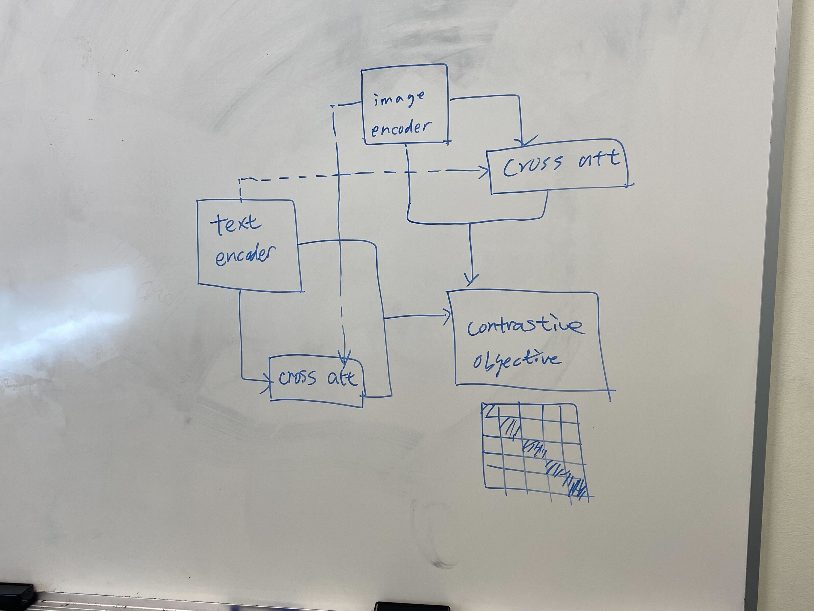

# additional/alternative project ideas

## MAGNET-CLIP: Domain Aware Efficient Contrastive Learning

MAGNET-CLIP: add **domain-specific** tags (via human evaluation/LLM prompting), similar to language-script-specific ones in MAGNET, to both image and text to boost both efficiency (token pooling) and performance (domain-aware)

## Flow-CLIP: CLIP with Efficient Flow Attention

Flow-CLIP: integrate flow attention into both CLIP encoders

## CAA-CLIP: CLIP with Cross Attention Augmentation

Cross attention is useful to learn joint representations - use cross attention before contrastive learning, to get *image_attend_text* and *text_attend_image*: concatenate cross attended part to original encoding to do contrastive learning in CLIP

